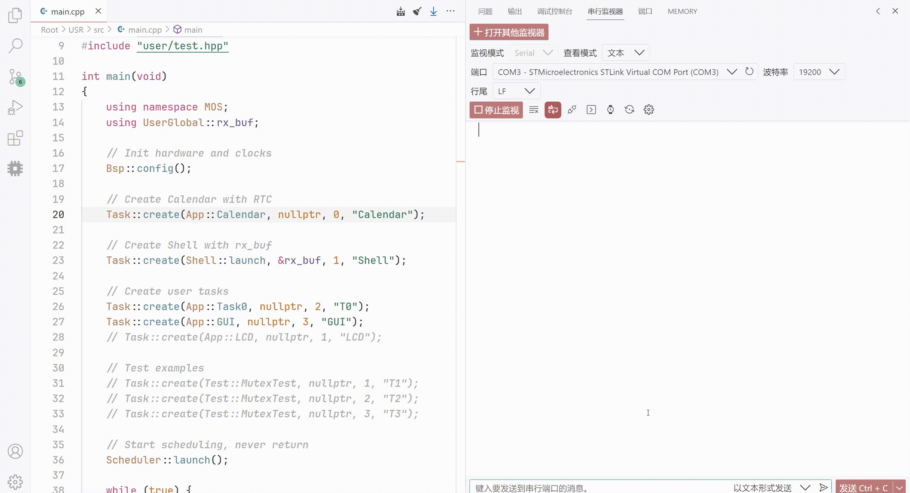
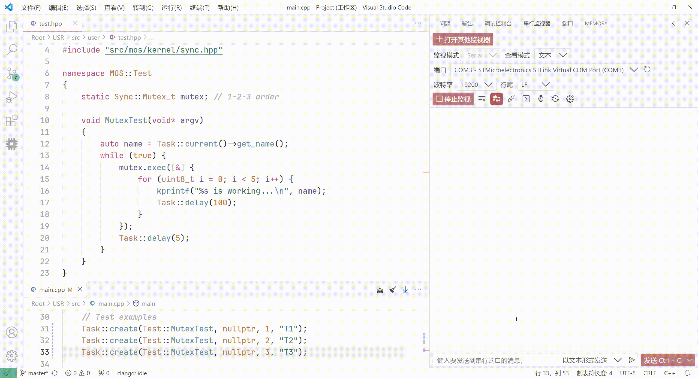
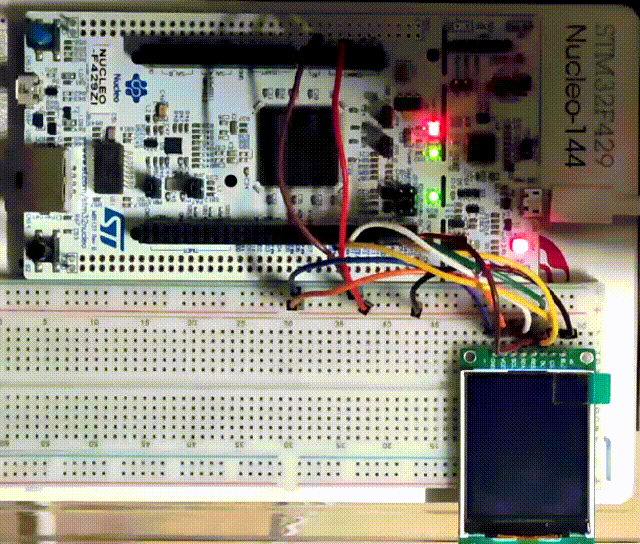
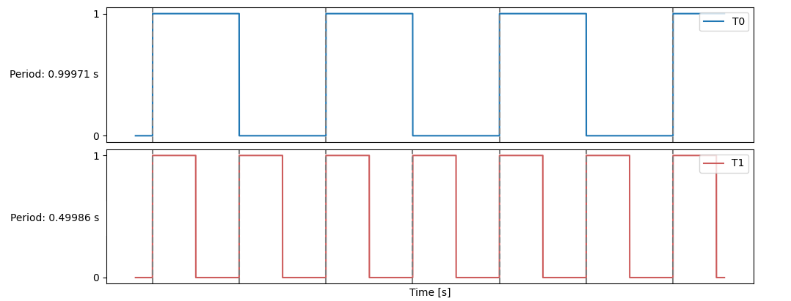
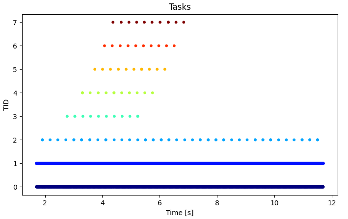

# MOS-STM32 🦉

### Introduction 🚀
[English](https://github.com/Eplankton/mos-stm32/blob/master/README.md) | [中文](https://gitee.com/Eplankton/mos-stm32/blob/master/README.md)
```
 A_A       _
o'' )_____//    [MOS-STM32]
 `_/  MOS  )    Mini RTOS on STM32F4, Cortex-M
 (_(_/--(_/     MOS <=> Mini-RTOS

- Board: Nucleo-144 F429ZI
- MCU:   STM32F429ZIT6 (256KB SRAM, 2MB FLASH)
```


### Repository 🌏
[GitHub](https://github.com/Eplankton/mos-stm32) | [Gitee](https://gitee.com/Eplankton/mos-stm32/)

### Structure 👾
[USR/src](https://github.com/Eplankton/mos-stm32/tree/master/USR/src)
```    
src
├── drivers                  Hardware Drivers(SPL, HAL...)
│   ├── stm32f4xx            STM32F4xx on-chip periphs(USART, I2C, SPI...)
│   └── device               Other components(LED, LCD...)
│
├── mos
│   ├── config.h             System Configuration
│   ├── arch                 Arch-related
│   │   └── cpu.hpp          ASM of ContextSwitch
│   │
│   ├── kernel               Kernel(Arch-independent)
│   │   ├── macro.hpp        Configured Macros
│   │   ├── type.hpp         Basic Types
│   │   ├── concepts.hpp     C++20 Concepts(Optional)
│   │   ├── data_type.hpp    Basic Data Structures
│   │   ├── alloc.hpp        Static/Dynamic Allocator
│   │   ├── global.hpp       Kernel Globals
│   │   ├── printf.c         Thread-safe printf
│   │   ├── task.hpp         Task create, yield, terminate, block...
│   │   ├── sync.hpp         Sync primitives
│   │   ├── scheduler.hpp    Scheduler and Policy
│   │   └── utils.hpp        Utils
│   │
│   ├── kernel.hpp           Import Kernel Modules
│   └── shell.hpp            Simple Shell
│
├── user
│   ├── gui                  GUI-related
│   │   ├── GuiLite.h        GuiLite Framework
│   │   └── UICode.cpp       Animation
│   │
│   ├── global.hpp           User Globals
│   ├── bsp.hpp              Board Support Package
│   ├── app.hpp              Applications
│   └── test.hpp             Test
│
├── main.cpp                 Entry main()
└── stm32f4xx_it.cpp         Interrput SubRoutine(Partly)
```

### Example 🍎
`Shell`


`MutexTest`


`LCD Driver & GUI Demo`

 

`T0/T1 Periods`


`Monitor by cur_tcb`


```C++
// MOS Kernel & Shell
#include "mos/kernel.hpp"
#include "mos/shell.hpp"

// HAL and device 
#include "drivers/stm32f4xx/hal.hpp"
#include "drivers/device/led.hpp"
```
```C++
namespace MOS::UserGlobal
{
    using namespace HAL::STM32F4xx;
    using namespace Driver::Device;
    using RxBuf_t = DataType::RxBuffer<Macro::RX_BUF_SIZE>;
    
    // Serial TX/RX
    auto& uart = convert(USARTx);

    // RX Buffer
    RxBuf_t rx_buf;

    // LED red, green, blue
    LED_t leds[] = {...};
}
```
```C++
namespace MOS::Bsp
{
    using namespace Driver;
    using namespace UserGlobal;

    void LED_Config()
    {
        for (auto& led: leds) {
            led.init();
        }
    }

    void USART_Config()
    {
        // Simplified
        uart.init(9600-8-1-N)
            .rx_config(PXa) // RX -> PXa
            .tx_config(PYb) // TX -> PYb
            .it_enable(RXNE) // Enable RXNE interrupt
            .enable();
    }

    void config()
    {
        LED_Config();
        USART_Config();
        SysTick_Config();
    }
}
```
```C++
namespace MOS::App
{
    Sync::Barrier_t bar {2};

    void Task1(void* argv)
    {
        using UserGlobal::leds;
        bar.wait();
        for (uint8_t i = 0; i < 20; i++) {
           leds[1].toggle();
           Task::delay(250);
        }
        kprintf("T1 exits...\n");
    }

    void Task0(void* argv)
    {
        using UserGlobal::leds;
        Task::create(Task1, nullptr, 1, "T1");
        bar.wait();
        while (true) {
            leds[0].toggle();
            Task::delay(500);
        }
    }
}
```
```C++
namespace MOS::Test
{
    static Sync::Mutex_t mutex;

    void MutexTest(void* argv)
    {
        auto name = Task::current()->get_name();
        while (true) {
            mutex.exec([&] {
                for (uint8_t i = 0; i < 5; i++) {
                    // In 1-2-3... order
                    kprintf("%s is working...\n", name);
                    Task::delay(100);
                }
            });
            Task::delay(5);
        }
    }
}
```
```C++
int main(void)
{
    using namespace MOS;
    using UserGlobal::rx_buf;

    // Init hardware and clocks
    Bsp::config();

    // Create Shell with rx_buf
    Task::create(Shell::launch, &rx_buf, 1, "Shell");
    
    // Create LED task
    Task::create(App::Task0, nullptr, 1, "T0");

    // Test examples
    // Task::create(Test::MutexTest, nullptr, 1, "T1");
    // Task::create(Test::MutexTest, nullptr, 2, "T2");
    // Task::create(Test::MutexTest, nullptr, 3, "T3");
    
    // Start scheduling, never return
    Scheduler::launch();

    while (true) {
        // Never run to here
    }
}
```

### Boot up ⚡
```
 A_A       _
o'' )_____//   Version @ x.x.x(...)
 `_/  MOS  )   Build   @ TIME, DATE
 (_(_/--(_/    Chip    @ MCU, ARCH

 Tid   Name   Priority   Status   Stack%
-----------------------------------------
 #0    idle      15      READY       10%
 #1    Shell      1      BLOCKED     21%
 #2    T0         2      RUNNING      9%
-----------------------------------------
```

### Version 🧾
```
📦 The initial version 0.0.1
1. Basic Scheduler and Task control

📌 To do
1. Timers, RoundRobin
2. Inter-process communication(IPC), pipes, message queues
3. Sync, semaphore, mutex, lock
4. Porting simple shells
5. Mutable page size, memory allocator
6. SPI driver and LVGL library
7. Port to ESP32-C3(RISC-V)
```
```
📦 Version 0.0.2
1. 1. Sync::{Semaphore_t, Lock_t, Mutex_t<T>, Cond_t, Barrier_t}, where Mutex_t adopts Priority Ceiling Protocol
2. Scheduler::Policy::PreemptivePriority, under same priority -> RoundRobin
3. Task::terminate() implicitly be called when task exits
4. Shell::{Command, CmdCall, launch}
5. KernelGlobal::os_ticks and Task::delay() for block delay
6. Add HAL::STM32F4xx::SPI_t and Driver::ST7735S_t, support GuiLite
7. Refactor the project into {kernel, arch, drivers}
8. Support GCC and STM32CubeMX HAL
9. Add HAL::STM32F4xx::RTC_t, CmdCall::date_cmd and App::Calendar

📌 To do
1. IPC::{pipe, message queue}, etc.
2. Simple dynamic memory allocator
3. Hardware Timers
4. BitMap for faster Page Allocation
5. Basic formal verification on Scheduler
```

### References 🛸
1. [How to build a Real-Time Operating System(RTOS)](https://medium.com/@dheeptuck/building-a-real-time-operating-system-rtos-ground-up-a70640c64e93)
2. [PeriodicScheduler_Semaphore](https://github.com/Dungyichao/PeriodicScheduler_Semaphore)
3. [STM32F4-LCD_ST7735s](https://github.com/Dungyichao/STM32F4-LCD_ST7735s)
4. [A printf/sprintf Implementation for Embedded Systems](https://github.com/mpaland/printf)
5. [GuiLite](https://github.com/idea4good/GuiLite)
6. [STMViewer](https://github.com/klonyyy/STMViewer)