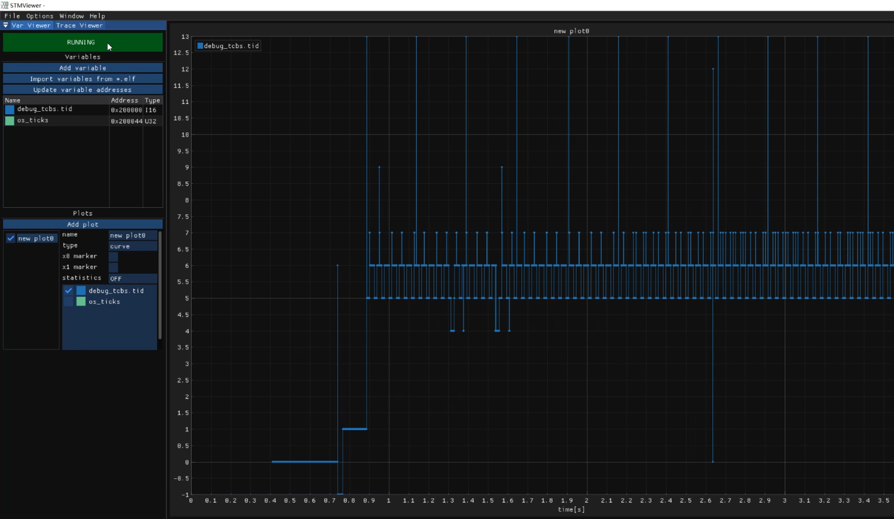

<p align="center">

</p>

### Introduction 🚀
-  **[English](https://github.com/Eplankton/mos-stm32/blob/master/README.md) | [中文](https://gitee.com/Eplankton/mos-stm32/blob/master/README.md)**
```
 A_A       _    MOS Real-Time Operating System
o'' )_____//    Simple RTOS on Cortex-M
 `_/  MOS  )    Developed using C/C++
 (_(_/--(_/     [Apache License Version 2.0]
```

### Repository 🌏
- `mos-core` 👉 **[GitHub(English)](https://github.com/Eplankton/mos-core) | [Gitee(中文)](https://gitee.com/Eplankton/mos-core/)**

- `mos-stm32` 👉 **[GitHub(English)](https://github.com/Eplankton/mos-stm32) | [Gitee(中文)](https://gitee.com/Eplankton/mos-stm32/)**

- `mos-renode` 👉 **[GitHub(English)](https://github.com/Eplankton/mos-renode) | [Gitee(中文)](https://gitee.com/Eplankton/mos-renode/)**

### Architecture 🔍
[USR/src](https://github.com/Eplankton/mos-stm32/tree/master/USR/src)

```C++
.
├── 📁 vendor              // Hardware Abstraction Layer (SPL/HAL/LL/...)
└── 📁 src
    ├── 📁 driver          // Interface Compatibility Layer
    │   ├── 📁 stm32f4xx   // STM32F4xx On-Chip Peripherals (USART, I2C, SPI, ...)
    │   └── 📁 device      // Other Hardware Components (LED, LCD, SD, ...)
    │
    ├── 📁 core
    │   ├── config.h             // System Configuration
    │   ├── 📁 arch              // Architecture Specific
    │   │   └── cpu.hpp          // Init/Context Switch
    │   │
    │   ├── 📁 kernel            // Kernel (Arch Independent)
    │   │   ├── macro.hpp        // Kernel Constants Macros
    │   │   ├── type.hpp         // Basic Types
    │   │   ├── concepts.hpp     // Type Constraints (Optional)
    │   │   ├── data_type.hpp    // Basic Data Structures
    │   │   ├── alloc.hpp        // Memory Management
    │   │   ├── global.hpp       // Kernel Global Variables
    │   │   ├── printf.h/.c      // Thread-Safe printf(*)
    │   │   ├── task.hpp         // Task Control
    │   │   ├── sync.hpp         // Synchronization Primitives
    │   │   ├── scheduler.hpp    // Scheduler
    │   │   ├── ipc.hpp          // Inter-Process Communication
    │   │   └── utils.hpp        // Other Utilities
    │   │
    │   ├── kernel.hpp           // Kernel Module
    │   └── shell.hpp            // Command Line Shell
    │
    ├── 📁 user
    │   ├── 📁 gui               // Graphical System
    │   │   ├── GuiLite.h        // GuiLite Framework
    │   │   └── UICode.cpp       // Custom UI
    │   │
    │   ├── global.hpp           // User Global Variables
    │   ├── bsp.hpp              // Board Support Package
    │   ├── app.hpp              // User Tasks
    │   ├── fatfs.hpp            // File System
    │   └── test.hpp             // Test Code
    │
    ├── main.cpp                 // System Entry Function
    └── stm32f4xx_it.cpp         // Interrupt Handler Routine
```

### Example 🍎
`Shell Test`


`Mutex Test(Priority Ceiling Protocol)`


`LCD Driver & GUI Demo`<br>
<p align="center">
  
 
</p>

`Concurrent Task Period & Time Sequence`<br>
<p align="center">



</p>

```C++
// MOS Kernel & Shell
#include "core/kernel.hpp"
#include "core/shell.hpp"

// HAL and Device 
#include "drivers/stm32f4xx/hal.hpp"
#include "drivers/device/led.hpp"
```
```C++
namespace MOS::User::Global
{
    using namespace HAL::STM32F4xx;
    using namespace Driver::Device;
    using namespace DataType;

    // Shell I/O UART and Buffer
    auto& stdio = STM32F4xx::convert(USARTx);
    DataType::SyncRxBuf_t<16> io_buf;

    // LED red, green, blue
    Device::LED_t leds[] = {...};
}
```
```C++
namespace MOS::User::BSP
{
    using namespace Driver;
    using namespace Global;

    void LED_Config()
    {
        for (auto& led: leds) {
            led.init();
        }
    }

    void USART_Config()
    {
        stdio.init(9600-8-1-N)
             .rx_config(PXa)  // RX -> PXa
             .tx_config(PYb)  // TX -> PYb
             .it_enable(RXNE) // Enable RXNE interrupt
             .enable();       // Enable UART
    }
    ...
}
```
```C++
namespace MOS::User::App
{
    Sync::Barrier_t bar {2}; // Set Barrier to sync tasks

    void led1(Device::LED_t leds[])
    {
        bar.wait();
        for (auto _: Range(0, 20)) {
           leds[1].toggle(); // green
           Task::delay(250_ms);
        }
        kprintf(
            "%s exits...\n",
            Task::current()->get_name()
        );
    }

    void led0(Device::LED_t leds[])
    {
        Task::create(
            led1, 
            leds, 
            Task::current()->get_pri(),
            "led1"
        );
        bar.wait();
        while (true) {
            leds[0].toggle(); // red
            Task::delay(500_ms);
        }
    }
    ...
}
```
```C++
int main()
{
    using namespace MOS;
    using namespace Kernel;
    using namespace User;
    using namespace User::Global;

    BSP::config(); // Init hardware and clocks

    Task::create( // Create Calendar with RTC
        App::time_init, nullptr, 0, "time/init"
    );

    Task::create( // Create Shell with buffer
        Shell::launch, &stdio.buf, 1, "shell"
    );

    /* User Tasks */
    Task::create(App::led_init, &leds, 2, "led/init");
    ...

    /* Test examples */
    Test::MutexTest();
    Test::MsgQueueTest();
    ...
    
    // Start scheduling, never return
    Scheduler::launch();
}
```

### Boot Up ⚡
```
 A_A       _   Version @ x.x.x(...)
o'' )_____//   Build   @ TIME, DATE
 `_/  MOS  )   Chip    @ MCU, ARCH
 (_(_/--(_/    2023-2024 Copyright by Eplankton

 Tid   Name   Priority   Status    Mem%
----------------------------------------
 #0    idle      15      READY      10%
 #1    shell      1      BLOCKED    21%
 #2    led0       2      RUNNING     9%
----------------------------------------
```

### Version 🧾


📦 `v0.1`

> ✅ Done:
> 
> - Basic data structures, scheduler, and task control, memory management
>
> 📌 Planned: 
> 
> - Timers, round-robin scheduling
> - Inter-Process Communication (IPC), pipes, message queues
> - Process synchronization (Sync), semaphores, mutexes
> - Porting a simple Shell
> - Variable page sizes, memory allocator
> - SPI driver, porting GuiLite/LVGL graphics libraries
> - Porting to other boards/arch, e.g., ESP32-C3 (RISC-V)


📦 `v0.2`

> ✅ Done:
> 
> - Synchronization primitives `Sync::{Sema_t, Lock_t, Mutex_t<T>, CondVar_t, Barrier_t}`
> - `Scheduler::Policy::PreemptPri` with round-robin `RoundRobin` scheduling for same priority levels
> - `Task::terminate` implicitly called upon task exit to reclaim resources
> - Simple command-line interaction `Shell::{Command, CmdCall, launch}`
> - `HAL::STM32F4xx::SPI_t` and `Driver::Device::ST7735S_t`, porting the `GuiLite` graphics library
> - Blocking delay with `Kernel::Global::os_ticks` and `Task::delay`
> - Refactored project organization into `{kernel, arch, drivers}`
> - Support for `GCC` compilation, compatible with `STM32Cube HAL`
> - Real-time calendar `HAL::STM32F4xx::RTC_t`, `CmdCall::date_cmd`, `App::Calendar`
> - `idle` uses `Kernel::Global::zombie_list` to reclaim inactive pages
> - Three basic page allocation policies `Page_t::Policy::{POOL, DYNAMIC, STATIC}`


📦 `v0.3`

> ✅ Done:
>
> - Mapping `Tids` to `BitMap_t`
> - Message queue `IPC::MsgQueue_t`
> - `Task::create` allows generic function signatures as `void fn(auto argv)` with type checker
> - Added `ESP32-C3` as a `WiFi` component
> - Added `Driver::Device::SD_t`, `SD` card driver, porting `FatFs` file system
> - Added `Shell::usr_cmds` for user-registered commands
> - **[Experimental]** Atomic types `<stdatomic.h>`
> - **[Experimental]** `Utils::IrqGuard_t`, nested interrupt critical sections
> - **[Experimental]** Simple formal verification of `Scheduler + Mutex`
>
> 
>
> 📌 Planned: 
>
> - Inter-Process Communication: pipes/channels
> - `FPU` hardware float support
> - Performance benchmarking
> - Error handling with `Result<T, E>`, `Option<T>`
> - `DMA_t` DMA Driver
> - Software/hardware timers `Timer`
> - **[Experimental]** Adding `POSIX` support
> - **[Experimental]** Asynchronous stackless coroutines `Async::{Future_t, async/await}`
> - **[Experimental]** More real-time scheduling algorithms


### References 🛸
- [How to build a Real-Time Operating System(RTOS)](https://medium.com/@dheeptuck/building-a-real-time-operating-system-rtos-ground-up-a70640c64e93)
- [PeriodicScheduler_Semaphore](https://github.com/Dungyichao/PeriodicScheduler_Semaphore)
- [STM32F4-LCD_ST7735s](https://github.com/Dungyichao/STM32F4-LCD_ST7735s)
- [A printf/sprintf Implementation for Embedded Systems](https://github.com/mpaland/printf)
- [GuiLite](https://github.com/idea4good/GuiLite)
- [STMViewer](https://github.com/klonyyy/STMViewer)
- [FatFs](http://elm-chan.org/fsw/ff)
- [The Zephyr Project](https://www.zephyrproject.org/)
- [Eclipse ThreadX](https://github.com/eclipse-threadx/threadx)
- [Embassy](https://embassy.dev/)

```
There's a movie on TV.
Four boys are walking on railroad tracks...
I better go, too.
```

<p align="center">

</p>