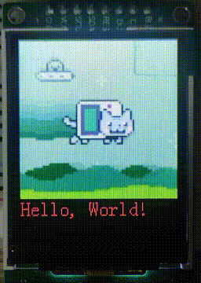
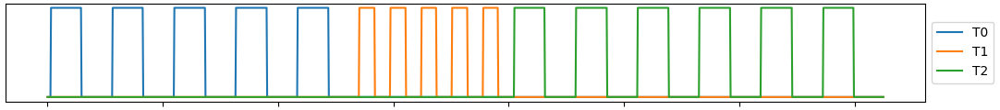

## MOS-STM32 🧀

### Introduction 🚀
[English](https://github.com/Eplankton/mos-stm32/blob/master/README.md) | [中文](https://gitee.com/Eplankton/mos-stm32/blob/master/README.md)
```
 A_A       _
o'' )_____//    [MOS-STM32]
 `_/  MOS  )    Mini RTOS on STM32F4, Cortex-M
 (_(_/--(_/     MOS <=> Mini-RTOS

- Board: Nucleo-144 F429ZI
- MCU:   STM32F429ZIT6 (256KB SRAM, 2MB FLASH)
```

### Repository 🌏
[GitHub](https://github.com/Eplankton/mos-stm32) | [Gitee](https://gitee.com/Eplankton/mos-stm32/)

### Architecture 🔍
[USR/src](https://github.com/Eplankton/mos-stm32/tree/master/USR/src)

```    
src
├── drivers                  Hardware Drivers(SPL/HAL/LL/...)
│   ├── stm32f4xx            STM32F4xx on-chip periphs(USART, I2C, SPI, ...)
│   └── device               Other components(LED, LCD, ...)
│
├── mos
│   ├── config.h             System Configuration
│   ├── arch                 Arch-related
│   │   └── cpu.hpp          asm for context_switch
│   │
│   ├── kernel               Kernel(Arch-independent)
│   │   ├── macro.hpp        Kernel Constant Macros
│   │   ├── type.hpp         Basic Types
│   │   ├── concepts.hpp     Type Constraints(Optional)
│   │   ├── data_type.hpp    Basic Data Structures
│   │   ├── alloc.hpp        Static/Dynamic Allocator
│   │   ├── global.hpp       Kernel Globals
│   │   ├── printf.c         Thread-safe printf
│   │   ├── task.hpp         Task control
│   │   ├── sync.hpp         Sync primitives
│   │   ├── scheduler.hpp    Scheduler and Policy
│   │   ├── ipc.hpp          Inter-Process Communication
│   │   └── utils.hpp        Utils
│   │
│   ├── kernel.hpp           Import Kernel Modules
│   └── shell.hpp            Simple Shell
│
├── user                     User program
│   ├── gui                  GUI-related
│   │   ├── GuiLite.h        GuiLite Framework
│   │   └── UICode.cpp       User Interface
│   │
│   ├── global.hpp           User Globals
│   ├── bsp.hpp              Board Support Package
│   ├── app.hpp              Applications
│   └── test.hpp             Test
│
├── main.cpp                 Entry main()
└── stm32f4xx_it.cpp         Interrput SubRoutine(Partly)
```

### Example 🍎
`Shell`


`MutexTest`


`LCD Driver & GUI Demo`<br>
  
 

`Concurrent Task Period & Time Sequence`<br>


`Async Executor`


```C++
// MOS Kernel & Shell
#include "mos/kernel.hpp"
#include "mos/shell.hpp"

// HAL and device 
#include "drivers/stm32f4xx/hal.hpp"
#include "drivers/device/led.hpp"
```
```C++
namespace MOS::UserGlobal
{
    using namespace HAL::STM32F4xx;
    using namespace Driver::Device;
    using namespace DataType;

    // Serial Input/Output
    auto& uart = STM32F4xx::convert(USARTx);

    // Shell Rx Buffer
    DataType::SyncRxBuf_t rx_buf;

    // LED red, green, blue
    Device::LED_t leds[] = {...};
}
```
```C++
namespace MOS::BSP
{
    using namespace Driver;
    using namespace UserGlobal;

    void LED_Config()
    {
        for (auto& led: leds) {
            led.init();
        }
    }

    void USART_Config()
    {
        // Simplified
        uart.init(9600-8-1-N)
            .rx_config(PXa) // RX -> PXa
            .tx_config(PYb) // TX -> PYb
            .it_enable(RXNE) // Enable RXNE interrupt
            .enable();
    }

    void config()
    {
        LED_Config();
        USART_Config();
        ...
    }
}
```
```C++
namespace MOS::App
{
    Sync::Barrier_t bar {2};

    void Task1()
    {
        using UserGlobal::leds;
        bar.wait();
        for (auto _: Range(0, 20)) {
           leds[1].toggle(); // green
           Task::delay(250);
        }
        kprintf("T1 exits...\n");
    }

    void Task0()
    {
        using UserGlobal::leds;
        Task::create(Task1, nullptr, 1, "T1");
        bar.wait();
        while (true) {
            leds[0].toggle(); // red
            Task::delay(500);
        }
    }
}
```
```C++
int main()
{
    using namespace MOS;
    using UserGlobal::rx_buf;

    // Init hardware and clocks
    BSP::config();

    // Create Shell with rx_buf
    Task::create(Shell::launch, &rx_buf, 1, "Shell");
    
    /* User Tasks */
    Task::create(App::Task0, nullptr, 2, "T0");

    /* Test examples */
    Test::MutexTest();
    Test::AsyncTest();
    ...
    
    // Start scheduling, never return
    Scheduler::launch();

    while (true) {
        // Never run to here
    }
}
```

### Boot Up ⚡
```
 A_A       _
o'' )_____//   Version @ x.x.x(...)
 `_/  MOS  )   Build   @ TIME, DATE
 (_(_/--(_/    Chip    @ MCU, ARCH

 Tid   Name   Priority   Status   Stack%
-----------------------------------------
 #0    idle      15      READY       10%
 #1    Shell      1      BLOCKED     21%
 #2    T0         2      RUNNING      9%
-----------------------------------------
```

### Version 🧾
```
📦 Version 0.0.1

✅ Done
1. Basic Scheduler and Task control

📌 Plan
1. Timers, RoundRobin
2. Inter-process communication(IPC), pipes, message queues
3. Sync, semaphore, mutex, lock
4. Porting simple shells
5. Mutable page size, memory allocator
6. SPI driver and LVGL library
7. Port to other platform like ESP32-C3(RISC-V)
```
```
📦 Version 0.0.2

✅ Done
1. Sync::{Sema_t, Lock_t, Mutex_t<T>, CondVar_t, Barrier_t}, where Mutex_t adopts Priority Ceiling Protocol
2. Scheduler::Policy::PreemptPri, under same priority -> RoundRobin
3. Task::terminate will be implicitly called when task exits
4. Shell::{Command, CmdCall, launch}
5. HAL::STM32F4xx::SPI_t and Driver::ST7735S_t, support GuiLite
6. KernelGlobal::os_ticks and Task::delay for blocking delay
7. Refactor the project into {kernel, arch, drivers}
8. Support GCC and STM32CubeMX HAL
9. HAL::STM32F4xx::RTC_t, CmdCall::date_cmd and App::Calendar
10. idle uses KernelGlobal::zombie_list to recycle inactive pages
11. Three basic page allocator policies, Page_t::Policy::{POOL, DYNAMIC, STATIC}
```
```
📦 Version 0.0.3

✅ Done
1. Tids from BitMap_t
2. (Experimental) Task::Async::{Future_t, async}
3. IPC::MsgQueue_t, Message Queue
4. Task::create allows generic fn signature as /* void fn(auto argv) */ with type check

📌 Plan
1. IPC::pipe/channel
2. Soft/Hardware Timers
3. Basic formal verification on Scheduler
4. DMA_t Driver
5. More scheduler algorithms
6. FPU support
7. Result<T, E>, Option<T>
```

### References 🛸
1. [How to build a Real-Time Operating System(RTOS)](https://medium.com/@dheeptuck/building-a-real-time-operating-system-rtos-ground-up-a70640c64e93)
2. [PeriodicScheduler_Semaphore](https://github.com/Dungyichao/PeriodicScheduler_Semaphore)
3. [STM32F4-LCD_ST7735s](https://github.com/Dungyichao/STM32F4-LCD_ST7735s)
4. [A printf/sprintf Implementation for Embedded Systems](https://github.com/mpaland/printf)
5. [GuiLite](https://github.com/idea4good/GuiLite)
6. [STMViewer](https://github.com/klonyyy/STMViewer)

```
Wake up, Neo...
The Matrix has you...
Follow the white rabbit.
Knock, knock, Neo.
```