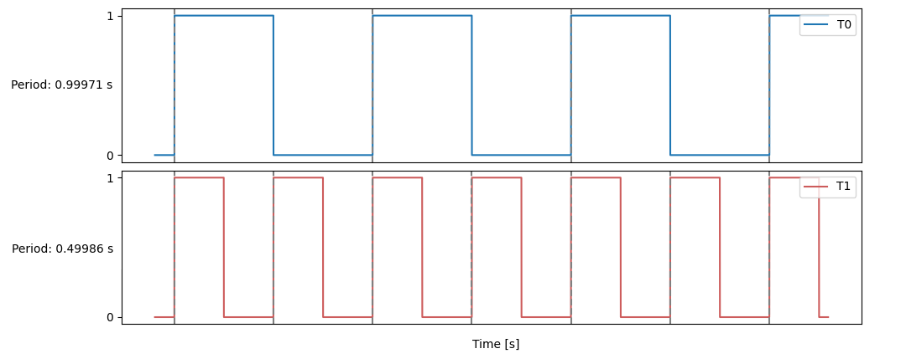

<p align="center">

</p>

### 介绍 🚀
- **[中文](https://gitee.com/Eplankton/mos-stm32/blob/master/README.md) | [English](https://github.com/Eplankton/mos-stm32/blob/master/README.md)**

```plain
 A_A       _    MOS Real-Time Operating System
o'' )_____//    Cortex-M 上的简单实时操作系统
 `_/  MOS  )    使用 C/C++ 开发
 (_(_/--(_/     [Apache License Version 2.0]
```

### 文档 📚

- **[用户手册(中文)](manual_zh.pdf)** 


### 仓库 🌏
- `mos-core` 👉 **[Gitee(中文)](https://gitee.com/Eplankton/mos-core/) | [GitHub(English)](https://github.com/Eplankton/mos-core)**

- `mos-stm32` 👉 **[Gitee(中文)](https://gitee.com/Eplankton/mos-stm32/) | [GitHub(English)](https://github.com/Eplankton/mos-stm32)**

- `mos-renode` 👉 **[Gitee(中文)](https://gitee.com/Eplankton/mos-renode/) | [GitHub(English)](https://github.com/Eplankton/mos-renode)**


### 架构 🔍
[USR/src](https://gitee.com/Eplankton/mos-stm32/tree/master/USR/src)

```
.
├── 📁 vendor              // 硬件抽象层(SPL/HAL/LL/...)
└── 📁 src
    ├── 📁 driver          // 接口兼容层
    │   ├── 📁 stm32f4xx   // STM32F4xx 片上外设(USART, I2C, SPI,...)
    │   └── 📁 device      // 其他元器件(LED, LCD, SD,...)
    │
    ├── 📁 core
    │   ├── 📁 arch              // 架构相关
    │   │   └── cpu.hpp          // 初始化/上下文切换
    │   │
    │   ├── 📁 kernel            // 内核层(架构无关)
    │   │   ├── macro.hpp        // 内核常量宏
    │   │   ├── type.hpp         // 基础类型
    │   │   ├── concepts.hpp     // 类型约束(可选)
    │   │   ├── data_type.hpp    // 基本数据结构
    │   │   ├── alloc.hpp        // 内存管理
    │   │   ├── global.hpp       // 内核层全局变量
    │   │   ├── printf.h/.c      // 线程安全的 printf(参考开源实现)
    │   │   ├── task.hpp         // 任务控制
    │   │   ├── sync.hpp         // 同步原语
    │   │   ├── scheduler.hpp    // 调度器
    │   │   ├── ipc.hpp          // 进程间通信
    │   │   └── utils.hpp        // 其他工具
    │   │
    │   ├── config.h             // 系统配置
    │   ├── kernel.hpp           // 内核模块
    │   └── shell.hpp            // Shell 命令行
    │
    ├── 📁 user                  // 用户层
    │   ├── 📁 gui               // 图形系统
    │   │   ├── GuiLite.h        // GuiLite 框架
    │   │   └── UICode.cpp       // 自定义 UI
    │   │
    │   ├── global.hpp           // 用户层全局变量
    │   ├── bsp.hpp              // 板级支持包
    │   ├── app.hpp              // 用户任务
    │   ├── fatfs.hpp            // FatFs 文件系统
    │   └── test.hpp             // 测试代码
    │
    ├── main.cpp                 // 系统入口函数
    └── stm32f4xx_it.cpp         // 中断处理子例程
```

### 示例 🍎
- `Shell交互`


- `Mutex测试(优先级天花板协议)`


- `LCD驱动与GUI`<br>
<p align="center">
  
 
</p>

- `并发任务周期与抢占`<br>
<p align="center">



</p>

```C++
// MOS Kernel & Shell
#include "core/kernel.hpp"
#include "core/shell.hpp"

// HAL and Device 
#include "drivers/stm32f4xx/hal.hpp"
#include "drivers/device/led.hpp"
```
```C++
namespace MOS::User::Global
{
    using namespace HAL::STM32F4xx;
    using namespace Driver::Device;
    using namespace DataType;

    // Shell I/O UART and Buffer
    auto& stdio = STM32F4xx::convert(USARTx);
    DataType::SyncRxBuf_t<16> io_buf;

    // LED red, green, blue
    Device::LED_t leds[] = {...};
}
```
```C++
namespace MOS::User::BSP
{
    using namespace Driver;
    using namespace Global;

    void LED_Config()
    {
        for (auto& led: leds) {
            led.init();
        }
    }

    void USART_Config()
    {
        stdio.init(9600-8-1-N)
             .rx_config(PXa)  // RX -> PXa
             .tx_config(PYb)  // TX -> PYb
             .it_enable(RXNE) // Enable RXNE interrupt
             .enable();       // Enable UART
    }
    ...
}
```
```C++
namespace MOS::User::App
{
    Sync::Barrier_t bar {2}; // Set Barrier to sync tasks

    void led1(Device::LED_t leds[])
    {
        bar.wait();
        for (auto _: Range(0, 20)) {
           leds[1].toggle(); // green
           Task::delay(250_ms);
        }
        kprintf(
            "%s exits...\n",
            Task::current()->get_name()
        );
    }

    void led0(Device::LED_t leds[])
    {
        Task::create(
            led1, 
            leds, 
            Task::current()->get_pri(),
            "led1"
        );
        bar.wait();
        while (true) {
            leds[0].toggle(); // red
            Task::delay(500_ms);
        }
    }
    ...
}
```
```C++
int main()
{
    using namespace MOS;
    using namespace Kernel;
    using namespace User;
    using namespace User::Global;

    BSP::config(); // Init hardware and clocks

    Task::create( // Create Calendar with RTC
        App::time_init, nullptr, 0, "time/init"
    );

    Task::create( // Create Shell with stdio.buf
        Shell::launch, &stdio.buf, 1, "shell"
    );

    /* User Tasks */
    Task::create(App::led_init, &leds, 2, "led/init");
    ...

    /* Test examples */
    Test::MutexTest();
    Test::MsgQueueTest();
    ...
    
    // Start scheduling, never return
    Scheduler::launch();
}
```

### 启动 ⚡
```plain
 A_A       _   Version @ x.x.x(...)
o'' )_____//   Build   @ TIME, DATE
 `_/  MOS  )   Chip    @ MCU, ARCH
 (_(_/--(_/    2023-2024 Copyright by Eplankton

 Tid   Name   Priority   Status    Mem%
----------------------------------------
 #0    idle      15      READY      10%
 #1    shell      1      BLOCKED    21%
 #2    led0       2      RUNNING     9%
----------------------------------------
```

### 版本 📜


📦 `v0.1`

> ✅ 完成：
> 
> - 基本的数据结构、调度器与任务控制、内存管理
>
> 📌 计划： 
> 
> - 定时器，时间片轮转调度
> - 进程间通信 `IPC`，管道、消息队列
> - 进程同步 `Sync`，信号量、互斥锁
> - 移植简单的 `Shell`
> - 可变页面大小，内存分配器
> - `SPI` 驱动，移植 `GuiLite/LVGL` 图形库
> - 移植到其他开发板/架构，例如 `ESP32-C3(RISC-V)`


📦 `v0.2`

> ✅ 完成：
> 
> - `Sync::{Sema_t, Lock_t, Mutex_t<T>, CondVar_t, Barrier_t}` 同步原语
> - `Scheduler::Policy::PreemptPri`，在相同优先级下则以时间片轮转 `RoundRobin` 调度
> - `Task::terminate` 在任务退出时隐式调用，回收资源
> - `Shell::{Command, CmdCall, launch}`，简单的命令行交互
> - `HAL::STM32F4xx::SPI_t` 和 `Driver::Device::ST7735S_t`, 移植 `GuiLite` 图形库
> - `Kernel::Global::os_ticks` 和 `Task::delay`，阻塞延时
> - 重构项目组织为 `{kernel, arch, drivers}`
> - 支持 `GCC` 编译，兼容 `STM32Cube HAL`
> - `HAL::STM32F4xx::RTC_t`, `CmdCall::date_cmd`, `App::Calendar` 实时日历
> - `idle` 使用 `Kernel::Global::zombie_list` 回收非活动页面
> - 三种基本的页面分配策略 `Page_t::Policy::{POOL(池), DYNAMIC(动态), STATIC(静态)}`


📦 `v0.3`

> ✅ 完成：
>
> - `Tids` 映射到 `BitMap_t`
> - `IPC::MsgQueue_t`，消息队列
> - `Task::create` 允许泛型函数签名为 `void fn(auto argv)`，提供类型检查
> - 添加 `ESP32-C3` 作为 `WiFi` 元件
> - 添加 `Driver::Device::SD_t`，`SD`卡驱动，移植 `FatFs` 文件系统
> - 添加 `Shell::usr_cmds`，用户注册命令
> - **[实验性]** 原子类型 `<stdatomic.h>`
> - **[实验性]** `Utils::IrqGuard_t`，嵌套中断临界区
> - **[实验性]** `Scheduler + Mutex` 简单的形式化验证
>
> 
>
> 📌 计划： 
>
> - 进程间通信：管道/通道
> - `FPU` 硬件浮点支持
> - 性能基准测试
> - `Result<T, E>, Option<T>`，错误处理
> - `DMA_t` 驱动
> - 软/硬件定时器 `Timer`
> - **[实验性]** 添加 `POSIX` 支持
> - **[实验性]** 异步无栈协程 `Async::{Future_t, async/await}`
> - **[实验性]** 更多实时调度算法


### 参考资料 🛸
- [How to build a Real-Time Operating System(RTOS)](https://medium.com/@dheeptuck/building-a-real-time-operating-system-rtos-ground-up-a70640c64e93)
- [PeriodicScheduler_Semaphore](https://github.com/Dungyichao/PeriodicScheduler_Semaphore)
- [STM32F4-LCD_ST7735s](https://github.com/Dungyichao/STM32F4-LCD_ST7735s)
- [A printf/sprintf Implementation for Embedded Systems](https://github.com/mpaland/printf)
- [GuiLite](https://github.com/idea4good/GuiLite)
- [STMViewer](https://github.com/klonyyy/STMViewer)
- [FatFs](http://elm-chan.org/fsw/ff)
- [The Zephyr Project](https://www.zephyrproject.org/)
- [Eclipse ThreadX](https://github.com/eclipse-threadx/threadx)
- [Embassy](https://embassy.dev/)

```
There's a movie on TV.
Four boys are walking on railroad tracks...
I better go, too.
```

<p align="center">

</p>