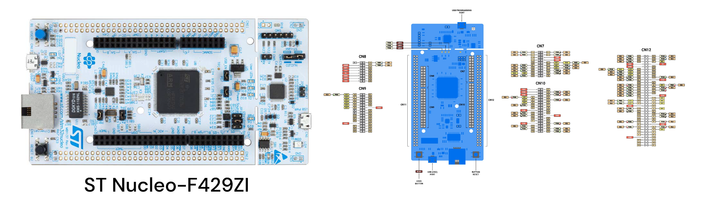

# MOS 实时操作系统：设计与实现


## 说明
### 简介

> - 本项目构建了一个小型嵌入式实时操作系统，包括内存管理、任务控制、任务调度、设备驱动等
> - 移植了文件系统、GUI 等，暂时没有配备 bootloader，系统上电直接进入操作系统运行


### 目标

> - 了解操作系统原理，参考已有的小型实时操作系统源码以及硬件平台手册资料
> - 实现内存管理、任务控制、任务调度、设备驱动、文件系统等组件
> - 提高自主设计开发操作系统的能力，锻炼汇编、C/C++ 语言的编程能力
> - 考虑系统运行效率、实时性等性能指标以及模块化开发构建
> 


### 概况

​	**Zephyr RTOS** 、**ThreadX** 和 **RT-Thread** 是目前具有代表性的实时操作系统，在某些方面相比传统 RTOS（如 **FreeRTOS**，**μCOS-III** 等）具有一定的改进和优势：

>- **高度模块化**：提供高度模块化的架构，允许开发者根据需要选择所需的组件，优化资源使用和系统性能。
>
>- **设备树集成**：使用设备树来描述硬件，提高硬件配置的灵活性和可扩展性。
>- **简洁的API**：提供简洁而强大的API集，使得系统配置和管理变得更加直观。
>- **可伸缩性**：允许在资源受限的简单微控制器上运行，同时也能扩展到更复杂的多核处理器系统。
>- **执行优化**：旨在提供快速的上下文切换和高效的中断处理和 tickless 低功耗休眠模式。
>- **实时性能**：提供极低的中断响应时间和高度的实时性能，适合需要快速响应的系统。

​	**Rust** 因其内存安全和现代系统编程语言特性，有望成为除 C/C++ 外嵌入式软件开发的新选择，其中 **Embassy** 和 **RTIC** 是两个专为嵌入式系统设计的异步执行框架（此二者并非 RTOS，性质更接近于 **Tokio**）：

> **内存安全**
>
> - **编译期内存安全**：所有权和借用检查机制有效防止数据竞争、空指针和缓冲区溢出等常见的内存错误。
>
> - **零成本抽象**：零成本抽象允许开发者使用高级语言特性（如迭代器、闭包等）而不引入运行时开销。
>
> **并发模型**
>
> - **异步编程**：利用异步 **async/await** 处理并发任务，允许编写异步非阻塞代码，减少上下文切换开销。
>
> - **中断驱动**：以事件驱动的设计模型简化中断管理，静态任务调度和资源分配，提高系统的响应速度。
>
> - **确定性**：提供高度确定性调度模型，精确控制任务的优先级和执行顺序，确保关键任务的可预测性。
>
> **开发效率和可维护性**
>
> - **强类型系统**：强类型系统在编译期进行计算以及错误检查，捕捉常见编程错误，减少调试成本。
>
> - **模块化和代码重用**：包管理系统和模块系统支持高度代码重用和模块化，快速构建复杂系统。


### 技术方案

​		**MOS** 从 **Zephyr RTOS** 和 **Embassy** 中获取灵感，旨在开发一个实验性的 RTOS，由于嵌入式开发需要使用大量的 **Legacy C/C++** 代码（HAL库、硬件驱动等），且 **rustc** 部分重要特性尚未稳定，出于兼容+性能的综合考虑，采用 **C++** 作为开发语言，理由如下：

> - C++ **Concepts** 与 Rust **Trait** 相似，可以实现强类型系统约束，支持复杂的模板元和函数式编程。
> -   C++ **Coroutine **与 Rust **Async** 相似，采用异步无栈协程，支持 **co_await/co_yield/co_return** 语法。
> -   C++ 对 C FFI (`Foreign Function Interface`)及 GDB/OpenOCD/ST-Link 等调试工具的适配性更佳。
> -   C++ 具有零成本抽象，支持 **RAII** (`Resource Acquisition Is Initialization`) 所有权和移动语义。


### 架构设计


​		**MOS** 实时操作系统主要由三个模块组成：内核层 `Kernel`，驱动层 `HAL & Driver`，用户层 `User`。

> 内核层 `Kernel`
>
> - 数据结构 `DataType`
> - 内存管理 `Alloc`
> - 全局变量 `Global`
> - 任务控制 `Task`
> - 调度器 `Scheduler`
> - 同步原语 `Sync`
> - 任务通信 `IPC`

> 驱动层 `HAL & Driver`
>
> - 硬件抽象 `HAL`，由制造商提供
> - 兼容接口 `Driver`，由系统提供
> - 设备驱动 `Device`，由用户提供

> 用户层 `User`
>
> - 全局变量 `Global`
> - 板级支持包 `BSP`
> - 图形系统 `GuiLite`
> - 文件系统 `FatFs`
> - 命令行 `Shell`
> - 测试用例 `Test`
> - 用户任务 `App`
>
> 其中 **[GuiLite 图形库](https://github.com/idea4good/GuiLite)，[FatFs 文件系统](http://elm-chan.org/fsw/ff)** 移植了现有的开源代码。


### 代码目录
```
.
├── vendor              // 硬件抽象层(SPL/HAL/LL/...)
└── src
    ├── driver          // 接口兼容层
    │   ├── stm32f4xx   // STM32F4xx片上外设(USART, I2C, SPI,...)
    │   └── device      // 其他元器件(LED, LCD, SD,...)
    │
    ├── mos
    │   ├── config.h             // 系统配置
    │   ├── arch                 // 架构相关
    │   │   └── cpu.hpp          // 初始化/上下文切换
    │   │
    │   ├── kernel               // 内核层代码(架构无关)
    │   │   ├── macro.hpp        // 内核常量宏
    │   │   ├── type.hpp         // 基础类型
    │   │   ├── concepts.hpp     // 类型约束(可选)
    │   │   ├── data_type.hpp    // 基本数据结构
    │   │   ├── alloc.hpp        // 内存管理
    │   │   ├── global.hpp       // 内核全局变量
    │   │   ├── printf.h/.c      // 线程安全的 printf(*)
    │   │   ├── task.hpp         // 任务控制
    │   │   ├── sync.hpp         // 同步原语
    │   │   ├── scheduler.hpp    // 调度器
    │   │   ├── ipc.hpp          // 进程间通信
    │   │   └── utils.hpp        // 其他工具
    │   │
    │   ├── kernel.hpp           // 内核模块
    │   └── shell.hpp            // 命令行 Shell
    │
    ├── user
    │   ├── gui                  // 图形系统
    │   │   ├── GuiLite.h        // GuiLite 框架
    │   │   └── UICode.cpp       // 自定义 UI
    │   │
    │   ├── global.hpp           // 用户全局变量
    │   ├── bsp.hpp              // 板级支持包
    │   ├── app.hpp              // 用户任务
    │   ├── fatfs.hpp            // FatFs 文件系统
    │   └── test.hpp             // 测试代码
    │
    ├── main.cpp                 // 系统入口函数
    └── stm32f4xx_it.cpp         // 中断处理子例程
```


### 硬件平台

开发板 | `ST NUCLEO-144 F429ZI`
:----:|:--------------------------------------:
MCU   | **STM32F429ZIT6** (180MHz, 256KB SRAM, 2MB Flash) 




## 内核层

### 一、数据结构

- 参见 `src/mos/kernel/data_type`，`MOS::Kernel::DataType`

    

#### **双向链表节点** `Node_t`

``` cpp
using Node_t = struct ListNode_t {
	NodePtr_t prev = this, next = this; // 默认情况下，节点自连接(self-linked)
};
```


#### **双向环形链表** `List_t`

​	侵入式（`Intrusive`）的链表节点内嵌为结构体成员，适合对内存使用有严格限制的嵌入式系统。


```cpp
using List_t = struct ListImpl_t {
	Node_t head;  // 首节点，作为起始/终点
	size_t len; // 链表长度
};
```
​	⛔ 通过`head`节点访问结构体数据的行为 **未定义**。

- `size() const`: 返回链表长度。
- `empty() const`: 检查链表是否为空。
- `begin() const`: 返回指向第一个节点的指针。
- `end() const`: 返回指向尾后位置的指针。
- `iter(auto&& fn) const`: 对链表中的每个节点执行给定函数。
- `iter_mut(auto&& fn)`: 对链表中的每个节点执行给定可变函数。
- `iter_until(auto&& fn) const`: 对链表中的每个节点执行给定函数，直到返回true。
- `add(Node_t& node)`: 在链表末尾添加节点。
- `insert(Node_t& node, NodePtr_t pos)`: 在指定位置插入节点。
- `insert_in_order(Node_t& node, auto&& cmp)`: 按顺序在指定位置插入插入节点。
- `remove(Node_t& node)`: 从链表中移除指定节点。
- `send_to(Node_t& node, List_t& dest)`: 将节点发送到链表。
- `send_to_in_order(Node_t& node, List_t& dest, auto&& cmp)`: 按顺序将节点发送到链表。
- `re_insert(Node_t& node, auto&& cmp)`: 按顺序重新插入节点到当前链表。


#### **任务控制块** `TCB_t`

​	用于存储和管理每个任务的状态信息，以便进行调度、同步、通信、跟踪和控制。

```cpp
struct TCB_t {
	enum class Status {
		READY, RUNNING, BLOCKED, TERMINATED // 就绪态，运行态，阻塞态，终止态
	};

	Node_t link;     // 任务链表节点
	StackPtr_t sp;   // 运行时栈顶
	Status status;   // 任务状态
	Tid_t tid;	     // 任务ID
	TcbPtr_t parent; // 指向父任务
	Tick_t time_slice, wake_point, stamp; // 时间片、唤醒点、时间戳
	Prior_t pri, old_pri; // 主/辅优先级，用于优先级继承
	Node_t event; // 事件链表节点，如 Send/Recv
	Fn_t fn;      // 任务函数入口
	Argv_t argv;  // 任务参数
	Name_t name;  // 任务名称
};
```
- `get_tid() const`:  获取任务ID。
- `get_status() const`:  获取状态。
- `get_name() const`:  获取名称。
- `get_pri() const`:  获取优先级。
- `get_wkpt() const`:  获取唤醒点。
- `stack_usage() const`:  计算栈使用率。
- `in_event() const`:  检查任务是否正在等待事件。
- `pri_cmp(lhs, rhs)`:  优先级比较。
- `wkpt_cmp(lhs, rhs)`:  唤醒点比较。


#### **内存页** `Page_t`

​	页面的大小由传入的参数决定，页面池分配默认大小 `1KB = 1024Bytes`，可通过宏修改。

​	⭐ 如下所示，`TCB_t`在页面的低地址起始处构造，而 **栈** 从高到低增长。


```cpp
struct Page_t {
	enum class Policy {
		STATIC, POOL, DYNAMIC, ERROR // 静态分配，页面池分配，动态分配，无效
	};
    
    Policy policy; // 页面分配策略
	Raw_t raw;     // 指向被分配的内存
	Size_t size;   // 页面大小
};
```


#### **位图** `BitMap_t`

​	每个位存储一个布尔值，用于高效地表示大量的状态或标记，比如用于记录页面池和任务ID的分配情况。


```cpp
template <size_t N>
struct BitMap_t {
	using Raw_t = uint32_t[(N + 7) / 8]; // 计算trunk的数量
	Raw_t data = {0};
};
```
- `set(uint32_t pos)`:  将指定位置的位设置为1。
- `reset(uint32_t pos)`:  将指定位置的位重置为0。
- `test(uint32_t pos) const`:  检查指定位置的位是否为1。
- `first_zero() const`:  从左到右查找并返回第一个为0的位置。


#### **环形队列** `Queue_t`

​	基于数组实现的队列，形成逻辑上首尾相接的环状结构，有效利用空间，常作为 **缓冲区** 使用。


```cpp
template <typename T, size_t N>
struct Queue_t {
	T data[N]; // 原始数组，长度为N
	size_t len, head, tail; // 当前元素个数、首/尾元素位置
};
```
- `capacity()`: 返回队列的容量。
- `data() const`: 返回队列的原始数组。
- `front()`: 返回队列的第一个元素的引用。
- `back()`: 返回队列的最后一个元素的引用。
- `pop()`: 弹出队列的第一个元素。
- `push(const T& val)`: 将值推入队列。
- `serve()`: 弹出并返回队列的第一个元素。
- `iter(auto&& fn) const`: 对队列中每个元素执行函数。
- `iter_mut(auto&& fn)`: 对队列中每个元素执行可变函数。


### 二、内存管理
- 参见 `src/mos/kernel/alloc.hpp`，`MOS::Kernel::Alloc`

    


```cpp
/* 
  根据传入的策略和页大小来分配内存页。如果是POOL，则在page_pool中查找未使用的页并返回；
  如果是DYNAMIC，则检查页大小是否有效，并使用动态分配的堆内存。如果策略无效，则直接返回nullptr。
*/
PageRaw_t palloc(Policy policy, PgSz_t pg_sz = -1) {
	switch (policy) {
		case POOL: { // 页面池分配
			auto pos = pool_map.first_zero();
			if (pos != -1) {
				return &page_pool[pos];
			}
			return nullptr;
		}
		case DYNAMIC: { // 堆分配
			MOS_ASSERT(pg_sz != -1, "Page Size Error");
			return new uint32_t[pg_sz];
		}
		default:
			return nullptr;
	}
}
```


### 三、任务控制
- 参见 `src/mos/kernel/task.hpp`，`MOS::Kernel::Task`


```cpp
ready_list,    // 包含按优先级 Prior_t 排序的 READY 状态任务，准备被调度
blocked_list,  // 包含处于 BLOCKED 状态且正在等待特定条件的任务
sleeping_list, // 包含按 delay_ticks 排序的正在休眠 BLOCKED 状态任务
zombie_list;   // 包含处于 TERMINATED 状态但部分资源尚未回收的任务
debug_tcbs;    // 仅用于调试模式，记录每个任务的指针，方便观察
```
- `current()`: 返回当前任务指针。
- `yield()`: 触发PendSV中断，让出CPU执行权。
- `higher_exists(TcbPtr_t tcb)`: 检查是否存在更高的任务。
- `tid_alloc()`: 分配任务ID。
- `recycle()`: 释放`zombie_list`中任务的资源并让出CPU。
- `num()`: 返回当前任务的数量。
- `page_alloc(Policy policy, PgSz_t pg_sz)`: 分配具有给定策略和大小的页面。
- `block(TcbPtr_t tcb)`: 阻塞任务并在必要时让出CPU。
- `resume(TcbPtr_t tcb, TcbList_t& src)`: 恢复阻塞的任务并在必要时让出CPU。
- `change_pri(TcbPtr_t tcb, Prior_t pri)`: 更改任务的优先级并重新插入就绪链表。
- `find(auto info)`: 根据任务ID或名称查找任务。
- `print_info(TcbPtr_t tcb, const char* format)`: 打印有关任务的信息。
- `delay(Tick_t ticks)`: 将当前任务延迟指定的时钟周期数。
- `wake(TcbPtr_t tcb)`: 从睡眠状态唤醒任务。
- `terminate()`: 终止任务，在必要时让出CPU。

```cpp
void terminate(TcbPtr_t tcb) {  
    // 从其所属的链表中移除任务TCB  
    if (tcb->is_status(RUNNING) || // 如果任务当前正在运行  
        tcb->is_status(READY)) { // 或者任务处于就绪状态  
        ready_list.remove(tcb); // 从就绪链表中移除该任务  
    }  
    else if (tcb->is_sleeping()) // 如果任务正在睡眠  
        sleeping_list.remove(tcb); // 从睡眠链表中移除该任务  
    else
        blocked_list.remove(tcb); // 否则从阻塞链表中移除

    tcb->set_status(TERMINATED); // 标记TCB为已终止状态  
    tids.reset(tcb->get_tid()); // 在位表中清除该任务的ID  
    debug_tcbs.remove(tcb); // 仅用于调试：从调试表中移除该TCB  

    if (tcb->page.is_policy(DYNAMIC)) { // 只有DYNAMIC策略的内存页需要延迟回收 
        zombie_list.add(tcb); // 添加到僵尸链表，等待稍后回收  
    else {  
        tcb->release(); // 否则，直接释放TCB占用的资源  
    }  
}
```

-  `setup_context()`:  加载初始上下文，包括堆栈指针、状态寄存器、程序计数器和参数等。

```cpp 
void setup_context(TcbPtr_t tcb) {  
    // 一个递减栈（descending stack）由16个寄存器组成上下文Context：  
    // |xPSR|PC|LR|R12|R3|R2|R1|R0|R11|R10|R9|R8|R7|R6|R5|R4|
    tcb->set_sp(&tcb->page.from_bottom(16)); // 设置栈顶指针(sp)

    // 设置栈中的xPSR寄存器的'T'位为'1'，通知处理器在异常返回时处于 Thumb 状态。  
    // V6-m 和 V7-m 核心只支持 Thumb 状态，所以该位应该始终设置为'1'。  
    tcb->set_xpsr(0x0100'0000);
    tcb->set_pc(tcb->fn); // 设置 PC（程序计数器）寄存器指向任务的入口函数  
    tcb->set_argv(tcb->argv); // 设置任务参数
    tcb->set_lr(terminate); // 设置 LR（链接寄存器）在任务结束时自动调用 terminate()
}
```

- `create()`:  创建具有指定函数、参数、优先级、名称和页面的任务。

```cpp
TcbPtr_t create(  
    auto fn, auto argv, Prior_t pri, // fn: 函数入口, argv: 参数, pri: 优先级
    Name_t name, Page_t page // name: 名称, page: 用于存储TCB的内存页
) {
	auto cur = current(), // 对fn和argv进行类型检查，并在页面中构造TCB
	     tcb = TCB_t::build(type_check(fn, argv), ...);  
  
	setup_context(tcb);        // 加载初始上下文（如寄存器状态等）  
	tcb->set_tid(tid_alloc()); // 为TCB分配一个唯一的任务ID  
	tcb->set_stamp(os_ticks);  // 设置时间戳（用于跟踪）  
	tcb->set_parent(cur);      // 设置父任务（这里设置为当前任务）  
	tcb->set_status(READY);    // 将状态设置为READY，表示已准备好运行  
	
    ready_list.insert_in_order(tcb, TCB_t::pri_cmp); // 按照优先级插入到就绪链表中  
	debug_tcbs.add(tcb); // 仅用于调试：将TCB添加到debug_tcbs中  
	return tcb; // 返回新创建的TCB的指针  
}
```

- `type_check()`：接受一个可调用对象`fn`(函数指针或无捕获的`Lambda`表达式)与参数`argv`。

    ​	若`fn(argv)`的调用满足`AsLambdaFn`或`AsFnPtr`约束，则认为是合法调用，返回`Fn_t`类型的函数指针；否则静态断言失败，编译器给出错误信息。


### 四、任务调度
- 参见 `src/mos/kernel/scheduler.hpp`，`MOS::Kernel::Scheduler`


#### **初始化**

​	参考 [FreeRTOS](https://www.freertos.org) 的汇编代码：

```assembly
ldr     r3, =cur_tcb    ; 将cur_tcb的地址加载到寄存器r3中
ldr     r1, [r3]        ; 从r3指向的地址（即cur_tcb）加载数据到寄存器r1
ldr     r0, [r1,#8]     ; 从r1指向的地址偏移8字节处加载数据到寄存器r0（栈指针sp）
ldmia   r0!, {r4-r11}   ; 从r0指向的地址开始，依次加载数据到寄存器r4至r11
msr     psp, r0         ; 将r0的值（更新后的栈指针sp）设置为进程栈指针psp
mov     r0, #0          ; 将寄存器r0清零
orr     lr, #0xD        ; 将链接寄存器lr设置为0xFFFF'FFFD，用于切换到线程模式
bx      lr              ; 使用修改后的lr值进行分支交换（bx），切换到线程模式并跳转到第一个任务函数入口
```

​	`ARM Cortex-M`架构的 **处理器模式** 和 **线程模式** 切换通过修改链接寄存器 **LR**`Link Register`来实现。

>**处理器模式（Handler Mode）**
>
>​		处理器模式是处理器在处理异常（如中断）时的模式。在这种模式下，处理器使用主栈指针（MSP），这是为异常处理保留的栈。当处理器进入处理器模式时，会保存当前的上下文（包括寄存器和程序计数器）到栈上，并跳转到异常向量表中相应的异常处理程序。
>
>
>
>**线程模式（Thread Mode）**
>
>​		线程模式是处理器在正常执行应用程序代码时的模式。在这种模式下，处理器可以使用主栈指针（MSP）或进程栈指针（PSP）。
>
>
>
>**切换机制**
>
>​		通过修改LR的值来实现模式切换。LR的最低两位用于指示处理器应该使用哪个栈指针（MSP或PSP）以及处理器应该处于哪种模式：
>
> - `0b00`：使用MSP，处理器模式
> - `0b01`：使用MSP，线程模式
> - `0b10`：使用PSP，处理器模式
> - `0b11`：使用PSP，线程模式
>


#### **上下文切换**

​	参考 [FreeRTOS](https://www.freertos.org) 的汇编代码：

```asm
mrs     r0, psp         ; 将程序栈指针(PSP)的值加载到寄存器r0
ldr     r3, =cur_tcb    ; 将cur_tcb的地址加载到寄存器r3      
ldr     r2, [r3]        ; 从r3指向的地址（即cur_tcb）加载当前TCB的地址到r2
stmdb   r0!, {r4-r11}   ; 使用r0作为基址，将寄存器r4-r11保存到栈上  
str     r0, [r2,#8]     ; 将更新后的r0（即当前任务的栈顶地址）保存到当前TCB的sp字段中  
stmdb   sp!, {r3,lr}    ; 将r3和lr（链接寄存器）保存到当前栈上，并更新栈指针sp   
bl      next_tcb        ; 调用next_tcb函数，调度策略决定下一个要执行的任务
ldmia   sp!, {r3,lr}    ; 从当前栈上加载r3和lr，并更新栈指针sp   
ldr     r1, [r3]        ; 从r3指向的地址加载新TCB的地址到r1   
ldr     r0, [r1,#8]     ; 从r1指向的TCB中加载新的栈顶地址到r0   
ldmia   r0!, {r4-r11}   ; 使用r0作为基址，从栈上加载寄存器r4-r11，并更新r0   
msr     psp, r0         ; 将r0的值（即新任务的栈顶地址）写回程序栈指针(PSP)
bx      lr              ; 跳转到lr中保存的地址，从中断处理程序返回
```

​	在`ARM Cortex-M`系列处理器中运行 RTOS 时：

- `MSP` 用于内核和中断处理例程，为中断处理提供一个独立的堆栈。

- `PSP` 为用户任务提供了一个独立的堆栈，用于保存局部变量和返回地址。

> ​    上下文切换过程中，当前任务的执行状态需要被保存，以便稍后恢复，同时新任务的执行状态需要被加载，这个过程通过`MSP`和`PSP`的切换来实现。一般由`SysTick`系统时钟的周期性中断触发上下文切换，首先保存当前任务的执行状态，将当前任务的堆栈指针`PSP`保存到其`TCB`中，以及一些关键的寄存器（`R4-R11`）压入堆栈，再通过调用`next_tcb`函数，让调度器选择下一个要执行的任务，并从其`TCB`中加载新的堆栈指针`PSP`，然后将之前保存的寄存器（`R4-R11`）从堆栈中弹出，恢复新任务的执行状态，最后通过`bx lr`指令从中断返回。
>


#### **调度策略**


##### **抢占式优先级调度** `Preemptive Priority Scheduling`

- 设当前任务`cr`，链表首/末任务`st，ed`，优先组中的下一个任务`nx`。

> 在`Policy::PreempPri`策略中，具有更高优先级的任务可以 **立即抢占 **当前任务。
> 通过`pri_cmp(st, cr)`比较首任务`st`与当前运行任务`cr`的优先级。
> 如果`st`具有更高的优先级，当前任务`cr`将被设置为`READY`状态并切换到`st`。
> 另外，若当前任务`cr`的时间片耗尽（即`time_slice <= 0`），时间片将被重置，
> 若此时后继存在与`cr`优先级相同的就绪任务，即`pri_equal(nx, cr) == true`，
> 那么将在这一组任务（即`PriGroup`，缩写`PG[i]`，`i`是优先级）中执行`RoundRobin`调度，
> 否则，切换回当前具有最高优先级的`st`。

- 伪代码


$$
\begin{align*}
&\textbf{Procedure: Schedule}(cr, st, nx, ed) \\
&\quad \textbf{if } cr.\text{status} \in \{\text{TERMINATED}, \text{BLOCKED}\} \\
&\quad \quad \text{switch\_to}(st) \\
&\quad \textbf{if } \text{policy} = \text{PreemptPri} \\
&\quad \quad \textbf{if } \text{pri\_cmp}(st, cr) \\
&\quad \quad \quad cr.\text{status} \leftarrow \text{READY} \\
&\quad \quad \quad \text{switch\_to}(st) \\
&\quad \quad \textbf{if } cr.\text{time\_slice} \leq 0 \\
&\quad \quad \quad cr.\text{time\_slice} \leftarrow \text{TIME\_SLICE} \\
&\quad \quad \quad cr.\text{status} \leftarrow \text{READY} \\
&\quad \quad \quad \textbf{if } nx \neq ed \land \text{pri\_equal}(nx, cr) \\
&\quad \quad \quad \quad \text{switch\_to}(nx) \\
&\quad \quad \quad \textbf{else} \\
&\quad \quad \quad \quad \text{switch\_to}(st) \\
&\quad \quad \quad \textbf{end if} \\
&\quad \quad \textbf{end if} \\
&\quad \textbf{end if} \\
&\textbf{End Procedure}
\end{align*}
$$


- 简单的形式化验证

​	**时序逻辑**（Temporal  Logic）是一种用于描述和验证系统行为的逻辑形式，特别适用于并发和分布式系统。以下是使用 **线性时序逻辑**（LTL, Linear Temporal Logic）来验证 **抢占式优先级调度算法** 的过程：


1. 定义状态变量
>- `cur_tcb`: 当前正在运行的任务
>- `ready_list`: 就绪任务队列
>- `cr`: 当前任务
>- `st`: 就绪队列的开始
>- `ed`: 就绪队列的结束
>- `nx`: 当前任务的下一个任务


2. 定义LTL公式

>- `G(P)`: 总是满足条件 `P`
>- `F(Q)`: 最终满足条件 `Q`
>- `X(R)`: 下一个状态满足条件 `R`
>- `U(S,T)`: 条件 `S` 一直成立直到条件 `T` 成立


3. 定义性质

>1. 优先级抢占性质
>
>   **性质1**: 如果就绪队列的第一个任务的优先级高于当前任务，那么最终会切换到第一个任务。
> $$
> \begin{equation}
>   \text{G{(pri\_cmp(st, cr))}} \rightarrow \text{F(cur\_tcb = st)}
>   \end{equation}
> $$
>
>
>2. 时间片耗尽性质
>
>   **性质2**: 如果当前任务时间片耗尽，那么最终会重置时间片。
> $$
> \begin{equation}
>   \text{G(time\_slice <= 0} \rightarrow \text{F(time\_slice = TIME\_SLICE))}
>   \end{equation}
> $$
>
>   **性质3**: 如果当前任务时间片耗尽，并且下一个任务的优先级与当前任务相同，那么最终会切换到下一个任务。
>$$
>\begin{equation}
>   \begin{aligned}
>   \text{G(time\_slice <= 0} \rightarrow
>   \text{(nx != ed} \land \text{pri\_equal(nx, cr)} \rightarrow
>   \text{F(cur\_tcb = nx)))}
>   \end{aligned}
>   \end{equation}
>$$
>
>   **性质4**: 如果当前任务时间片耗尽，并且下一个任务的优先级与当前任务不同，那么最终会切换到就绪队列的第一个任务。
>$$
>\begin{equation}
>   \begin{aligned}
>   \text{G(time\_slice <= 0} \rightarrow
>   \text{(nx = ed} \lor \neg \text{pri\_equal(nx, cr)} \rightarrow
>   \text{F(cur\_tcb = st)))}
>   \end{aligned}
>   \end{equation}
>$$
>
>
>3. 处理终止或阻塞任务性质
>
>   **性质5**: 如果当前任务状态是 TERMINATED 或 BLOCKED，则最终会切换到就绪队列的第一个任务。
> $$
> \begin{equation}
>   \text{G(is\_status(TERMINATED)} \lor \text{is\_status(BLOCKED)} \rightarrow \text{F(cur\_tcb = st))}
>   \end{equation}
> $$
>
>
>4. 组合所有性质
>
>$$
>\begin{equation}
>\begin{aligned}
>&\text{G(pri\_cmp(st, cr)} \rightarrow \text{F(cur\_tcb = st))} \land \\
>&\text{G(time\_slice <= 0} \rightarrow \text{F(time\_slice = TIME\_SLICE))} \land \\
>&\text{G(time\_slice <= 0} \rightarrow \text{(nx != ed} \land \text{pri\_equal(nx, cr)} \rightarrow \text{F(cur\_tcb = nx)))} \land \\
>&\text{G(time\_slice <= 0} \rightarrow \text{(nx = ed} \lor \neg \text{pri\_equal(nx, cr)} \rightarrow \text{F(cur\_tcb = st)))} \land \\
>&\text{G(is\_status(TERMINATED)} \lor \text{is\_status(BLOCKED)} \rightarrow \text{F(cur\_tcb = st))}
>\end{aligned}
>\end{equation}
>$$


4. 自动化验证

​	使用形式化验证工具（如 **Coq**）来辅助验证时序逻辑性质是一种常见且有效的方法。

- 定义系统状态和性质：

```Coq
(* 导入必要的库 *)
Require Import Coq.Logic.Classical_Prop.
Require Import Coq.Logic.FunctionalExtensionality.

(* 定义状态类型 *)
Inductive Status := TERMINATED | BLOCKED | READY | RUNNING | OTHER.

(* 定义任务控制块（TCB） *)
Record TCB := {
  status : Status;
  time_slice : nat;
}.

(* 定义系统状态 *)
Record SystemState := {
  cur_tcb : TCB;
  st : TCB;
  nx : TCB;
  ed : TCB;
  policy : bool (* true 表示 PreemptPri, false 表示其他策略 *)
}.

(* 定义优先级比较函数 *)
Parameter pri_cmp : TCB -> TCB -> Prop.
Parameter pri_equal : TCB -> TCB -> Prop.

(* 定义切换函数 *)
Definition switch_to (tcb : TCB) (s : SystemState) : SystemState :=
  {| cur_tcb := {| status := RUNNING; time_slice := tcb.(time_slice) |};
     st := s.(st);
     nx := s.(nx);
     ed := s.(ed);
     policy := s.(policy) |}.

(* 定义性质1 *)
Definition Property1 (s : SystemState) : Prop :=
  s.(policy) = true ->
  pri_cmp s.(st) s.(cur_tcb) ->
  exists s', switch_to s.(st) s = s' /\ s'.(cur_tcb) = s.(st).

(* 定义性质2 *)
Definition Property2 (s : SystemState) : Prop :=
  s.(policy) = true ->
  s.(cur_tcb).(time_slice) <= 0 ->
  exists s', switch_to s.(st) s = s' /\ s'.(cur_tcb).(time_slice) = TIME_SLICE.

(* 定义性质3 *)
Definition Property3 (s : SystemState) : Prop :=
  s.(policy) = true ->
  s.(cur_tcb).(time_slice) <= 0 ->
  s.(nx) <> s.(ed) ->
  pri_equal s.(nx) s.(cur_tcb) ->
  exists s', switch_to s.(nx) s = s' /\ s'.(cur_tcb) = s.(nx).

(* 定义性质4 *)
Definition Property4 (s : SystemState) : Prop :=
  s.(policy) = true ->
  s.(cur_tcb).(time_slice) <= 0 ->
  (s.(nx) = s.(ed) \/ ~pri_equal s.(nx) s.(cur_tcb)) ->
  exists s', switch_to s.(st) s = s' /\ s'.(cur_tcb) = s.(st).

(* 定义性质5 *)
Definition Property5 (s : SystemState) : Prop :=
  (s.(cur_tcb).(status) = TERMINATED \/ s.(cur_tcb).(status) = BLOCKED) ->
  exists s', switch_to s.(st) s = s' /\ s'.(cur_tcb) = s.(st).

(* 组合所有性质 *)
Definition CombinedProperties (s : SystemState) : Prop :=
  Property1 s /\ Property2 s /\ Property3 s /\ Property4 s /\ Property5 s.
```


- 逐步证明每个性质（这里仅给出一般框架）

```
Theorem Property1_proof : forall s, Property1 s.
Proof.
  intros s Hpolicy Hpri_cmp.
  exists (switch_to s.(st) s).
  split.
  - reflexivity.
  - unfold switch_to.
    simpl.
    reflexivity.
Qed.
```


- 组合性质

```
Theorem CombinedProperties_proof : forall s, CombinedProperties s.
Proof.
  intros s.
  unfold CombinedProperties.
  split.
  - apply Property1_proof.
  - split.
    + apply Property2_proof.
    + split.
      * apply Property3_proof.
      * split.
        -- apply Property4_proof.
        -- apply Property5_proof.
Qed.
```


### 五、任务通信

- 参见 `src/mos/kernel/ipc.hpp`，`MOS::Kernel::IPC`


#### **消息队列** `MsgQueue_t<T, N>`

​	允许任务间以 **消息** 形式进行通信，由 **环形队列**`Queue_t<T, N>` 和 **事件阻塞链表**`senders/receivers` 组成，有效实现异步通信和组件解耦，提高系统整体的响应性和吞吐量。


```cpp
template <typename T, size_t N>
struct MsgQueue_t {
    EventList_t senders, receivers; // 事件阻塞链表 Send/Recv
	Queue_t<T, N> queue; // 环形队列(缓冲区)，长度为 N
};
```

​	阻塞时`TCB_t`被 **同时** 连接到`sleeping_list`和`senders/receivers`，任务被 **唤醒** 只有两种情况：

> - 消息发送或被接收时，消息队列 **主动 **唤醒`senders/receivers`中被阻塞的任务，判定为`Ok`。
>
> - 调度器`Scheduler`发现`sleeping_list`中睡眠的任务需要 **被动** 唤醒，判定为`TimeOut`。

- `send()` ：将消息推入队列并唤醒等待接收消息的任务，若队列已满且阻塞超时则返回 `TimeOut`。

```cpp
auto send(const T& msg, Tick_t timeout = 0) {
    // 如果消息队列已满，尝试阻塞发送者，若超时则返回 TimeOut
    if (raw.full() && wait_on(senders, timeout) == TimeOut)
        return TimeOut;
    raw.push(msg); // 将消息推入队列
    try_wake_up(receivers); // 尝试唤醒等待接收消息的任务
    return Ok; // 发送操作成功，返回 Ok
}
```

- `recv()` ：从队列获取消息并唤醒等待发送消息的任务，若队列为空且阻塞超时则返回 `TimeOut`。

```cpp
auto recv(T& buf, Tick_t timeout = 0) {
    // 如果消息队列为空，尝试阻塞等待者，若超时则返回 TimeOut
    if (raw.empty() && wait_on(receivers, timeout) == TimeOut)
        return TimeOut;
    buf = raw.serve(); // 从队列中取出消息到 buf
    try_wake_up(senders); // 尝试唤醒等待发送消息的任务
    return Ok; // 接收操作成功，返回 Ok
}
```

​	⭐ 如上所示，`send()/recv()`这一对函数高度相似、对称，区别仅在于阻塞的条件不同。

- `pri_wkpt_cmp()`：先比较任务的优先级高低，若相等则再比较唤醒点的前后顺序。

- `wait_on()`：将当前任务插入到目标事件链表进行阻塞等待，超时返回 `TimeOut`，成功返回`Ok`

```cpp
auto wait_on(EventList_t& dest, Tick_t timeout) {
    if (timeout == 0) // 如果超时值为0，则立即返回 TimeOut
        return TimeOut;
    // 将当前任务的事件节点event按照优先级和唤醒点有序插入到事件链表中
    dest.insert_in_order(Task::current()->event, pri_wkpt_cmp);
    Task::delay(timeout); // 睡眠，被唤醒后从这里继续往下执行
    // 唤醒后检查是否超时，如果任务仍在事件链表中，说明等待失败，返回 TimeOut
    return check_for(dest);
}
```


### 六、任务同步
- 参见 `src/mos/kernel/sync.hpp`，`MOS::Kernel::Sync`

    

#### **信号量** `Sema_t`

​	用于控制多个任务对共享资源访问的同步机制，通过`P/V`操作来实现资源的获取和释放。

```cpp
struct Sema_t {
	TcbList_t waiting_list; // 等待链表
	Cnt_t cnt; // 原子计数，可用资源数量
};
```
- `down()`：也称`wait()`，执行 **P** 操作，计数递减；若小于等于零，则还要将任务阻塞至等待链表。

- `up()`：也称`signal()`，执行 **V** 操作，计数递增；若有任务正在等待信号量，则唤醒其中一个任务。

- `up_from_isr()`：也称`signal_from_isr()`，从中断服务程序（ISR）中调用，不会触发调度。


#### **互斥锁** `Mutex_t`

​	互斥锁可以看作是一种特殊的二进制信号量，用于确保任务 **互斥** 地访问共享资源，支持递归加锁。

```cpp
struct MutexImpl_t {
	Sema_t sema     = 1; // 仅用作存储 waiting_list, cnt
	Cnt_t recursive = 0; // 原子计数，递归层数
	TcbPtr_t owner  = nullptr; // 持有者
	Prior_t ceiling = PRI_MIN; // 优先级天花板
};

template <typename T = void>
struct Mutex_t : public MutexImpl_t {
    struct MutexGuard_t { // 互斥锁守卫
		MutexGuard_t(Mutex_t& m): mtx(m) { mtx.lock(); }
	   ~MutexGuard_t() { mtx.unlock(); }
		T& get() { return mtx.raw; }
	private:
        Mutex_t<T>& mtx;
	};
    
    auto lock() { return MutexGuard_t {*this}; }
    
private:
    T raw; // 需要互斥保护的数据
};

// 模板参数类型推导
Mutex_t() -> Mutex_t<void>; // 空类型 -> 空构造
Mutex_t(T&&) -> Mutex_t<T>; // 右值 -> 值构造
Mutex_t(T&) -> Mutex_t<T&>; // 引用 -> 引用构造

// 使用方法
Mutex_t mtx {}; // 声明 void 类型的互斥锁
mtx.exec([&] { /* 在互斥锁保护下执行代码 */ });

Mutex_t mi {233}; // 声明 int 类型的互斥锁
Mutex_t mf {114.514f}; // 声明 float 类型的互斥锁
Mutex_t mq {Queue_t<int, 5> {}}; // 声明用互斥锁保护的队列

Foo foo;
Mutex_t mx {foo}; // 声明一个包含 Foo& 引用类型的互斥锁

                 // ↓ MutexGuard_t 返回 Foo&
auto res = mx.lock().get().method(); // 链式调用，在 Foo& 上调用成员函数 method()，返回结果后解锁
           // ↖ 尝试锁定，若成功则产生一个 MutexGuard_t
```


##### **优先级天花板协议** `Priority Ceiling Protocol` 

​	⭐ 一种用通过 **动态调整** 任务优先级来避免优先级反转和死锁的技术。

- `lock()`：当一个任务尝试获取锁时，首先检查当前任务是否已经是锁的持有者。如果是，则增加递归计数即可，否则需要进行更新。引入 **“天花板”** 优先级`ceiling`代表等待锁的任务中的最高优先级。如果当前任务的优先级低于天花板，任务的优先级会被临时提升到天花板，以防止优先级反转。如果当前任务的优先级高于天花板，则天花板会被更新为当前任务的优先级，并且所有等待任务的优先级也会被提升到这个新的天花板。

    

- `unlock()`：首先减少递归计数。如果递归计数大于0，表示锁仍然被持有，不需要进一步操作。如果递归计数为0，表示锁完全释放，此时会恢复原持有任务的优先级，并检查是否有任务在等待锁。如果有等待任务，则重新计算天花板，并唤醒等待链表中的第一个任务。如果唤醒的任务优先级高于当前天花板，会更新天花板并重新调整所有等待任务的优先级。

    

- `find_ceiling()`：在锁释放时重新计算天花板，找到最高优先级的任务作为新的天花板。

- `update_pri()`：更新所有等待任务的优先级到当前的天花板。

​	该协议确保：当高优先级任务需要访问被低优先级任务持有的资源时，低优先级任务的优先级会被提升以尽快完成执行，从而避免了优先级反转的问题，因为所有涉及的任务都会被动态地调整到相同的优先级水平，但需要注意`find_ceiling()`, `update_pri()`会导致一定的性能开销。


- 伪代码

$$
\begin{align*}
&\textbf{Procedure: lock()} \\
&\quad \textbf{if } \text{cur\_tcb} = \text{lock\_owner} \\
&\quad \quad \text{recursion\_count} \leftarrow \text{recursion\_count} + 1 \\
&\quad \textbf{else} \\
&\quad \quad \textbf{if } \text{cur\_tcb.priority} < \text{ceiling} \\
&\quad \quad \quad \text{cur\_tcb.priority} \leftarrow \text{ceiling} \\
&\quad \quad \textbf{else} \\
&\quad \quad \quad \text{ceiling} \leftarrow \text{cur\_tcb.priority} \\
&\quad \quad \quad \text{update\_pri()} \\
&\quad \quad \textbf{end if} \\
&\quad \quad \text{lock\_owner} \leftarrow \text{cur\_tcb} \\
&\quad \quad \text{recursion\_count} \leftarrow 1 \\
&\quad \textbf{end if} \\
&\textbf{End Procedure} \\
\end{align*}
$$


$$
\begin{align*}
&\textbf{Procedure: find\_ceiling()} \\
&\quad \textbf{return} \max(\text{priority of all waiting tasks}) \\
&\textbf{End Procedure} \\
\\
&\textbf{Procedure: update\_pri()} \\
&\quad \textbf{for each } \text{task in waiting\_tasks} \\
&\quad \quad \text{task.priority} \leftarrow \text{ceiling} \\
&\quad \textbf{end for} \\
&\textbf{End Procedure}
\end{align*}
$$

$$
\begin{align*}
&\textbf{Procedure: unlock()} \\
&\quad \text{recursion\_count} \leftarrow \text{recursion\_count} - 1 \\
&\quad \textbf{if } \text{recursion\_count} = 0 \\
&\quad \quad \text{cur\_tcb.priority} \leftarrow \text{original\_priority} \\
&\quad \quad \text{lock\_owner} \leftarrow \text{None} \\
&\quad \quad \textbf{if } \text{waiting\_tasks} \neq \text{empty} \\
&\quad \quad \quad \text{ceiling} \leftarrow \text{find\_ceiling()} \\
&\quad \quad \quad \text{wake\_up(waiting\_tasks.first)} \\
&\quad \quad \quad \text{update\_pri()} \\
&\quad \quad \textbf{end if} \\
&\quad \textbf{end if} \\
&\textbf{End Procedure} \\
\end{align*}
$$


- 简单的形式化验证

​	类似调度算法`Scheduler::PreemptPri`的形式化验证流程。

>**性质1**：加锁操作
>	如果当前任务已经是锁的持有者，则锁操作不会改变锁的持有者。如果当前任务不是锁的持有者，则锁操作会更新锁的持有者，并且当前任务的优先级会被提升到天花板优先级。
>$$
>\begin{equation}
>\begin{aligned}
>&\text{G} \left( \text{owner} = \text{cur\_tcb} \rightarrow \text{X} (\text{owner} = \text{cur\_tcb}) \right) \land \\
>&\text{G} \left( \text{owner} \neq \text{cur\_tcb} \rightarrow \text{X} (\text{owner} = \text{cur\_tcb} \land \right. \left. \text{cur\_tcb.priority} = \max(\text{cur\_tcb.priority}, \text{ceiling})) \right)
>\end{aligned}
>\end{equation}
>$$
>
>**性质2**：解锁操作
>
>​	如果当前任务是锁的持有者，则解锁操作会释放锁，并且恢复当前任务的原始优先级。如果有必要则重新计算天花板优先级，并唤醒等待链表中的第一个任务。
>$$
>\begin{equation}
>\begin{aligned}
>&\text{G} \left( \text{lock\_owner} = \text{cur\_tcb} \rightarrow \text{X} (\text{lock\_owner} = \text{None} \land \text{cur\_tcb.priority} = \text{old\_priority} \land \right. \\
>&\quad \left. (\text{waiting\_list} \neq \text{empty} \rightarrow \text{ceiling} = \max(\text{waiting\_list}) \land \text{wake\_up}(\text{waiting\_list.first}))) \right)
>\end{aligned}
>\end{equation}
>$$
>
>
>**性质3**：优先级更新
>
>​	更新所有等待任务的优先级到当前的天花板优先级。
>$$
>\begin{equation}
>\text{G} \left( \text{update\_pri} \rightarrow \text{X} \left( \forall t \in \text{waiting\_list}, t.priority = \text{ceiling} \right) \right)
>\end{equation}
>$$


1. 定义系统状态和性质

```
(* 导入必要的库 *)
Require Import Coq.Logic.Classical_Prop.
Require Import Coq.Logic.FunctionalExtensionality.

(* 定义状态类型 *)
Inductive Status := RUNNING | WAITING | LOCKED | UNLOCKED.

(* 定义任务控制块（TCB） *)
Record TCB := {
  priority : nat;
  status : Status;
  ceiling : nat;
}.

(* 定义系统状态 *)
Record SystemState := {
  cur_tcb : TCB;
  lock_owner : option TCB;
  waiting_tasks : list TCB;
}.

(* 定义优先级比较函数 *)
Parameter pri_cmp : TCB -> TCB -> Prop.

(* 定义加锁和解锁函数 *)
Parameter lock : SystemState -> SystemState.
Parameter unlock : SystemState -> SystemState.

(* 定义更新优先级函数 *)
Parameter update_pri : SystemState -> SystemState.

(* 定义计算天花板函数 *)
Parameter find_ceiling : SystemState -> nat.

(* 定义性质1：加锁操作 *)
Definition Property1 (s : SystemState) : Prop :=
  let s' := lock s in
  match s.(lock_owner) with
  | Some owner =>
      if owner =? s.(cur_tcb) then
        s'.(cur_tcb).(status) = LOCKED
      else
        s'.(cur_tcb).(priority) = max s.(cur_tcb).(priority) (find_ceiling s)
  | None =>
      s'.(lock_owner) = Some s.(cur_tcb) /\
      s'.(cur_tcb).(priority) = max s.(cur_tcb).(priority) (find_ceiling s)
  end.

(* 定义性质2：解锁操作 *)
Definition Property2 (s : SystemState) : Prop :=
  let s' := unlock s in
  match s.(lock_owner) with
  | Some owner =>
      if owner =? s.(cur_tcb) then
        s'.(cur_tcb).(status) = UNLOCKED /\
        (forall t, In t s.(waiting_tasks) -> t.(priority) = find_ceiling s)
      else
        True
  | None => True
  end.

(* 定义性质3：更新优先级 *)
Definition Property3 (s : SystemState) : Prop :=
  let s' := update_pri s in
  forall t, In t s.(waiting_tasks) -> t.(priority) = find_ceiling s.

(* 组合所有性质 *)
Definition CombinedProperties (s : SystemState) : Prop :=
  Property1 s /\ Property2 s /\ Property3 s.
```

2. 逐步证明每个性质

​	性质1：加锁操作

```
Theorem Property1_proof : forall s, Property1 s.
Proof.
  intros s.
  unfold Property1.
  destruct (lock_owner s) eqn:Howner.
  - destruct (t =? cur_tcb s) eqn:Heq.
    + (* 当前任务已经是锁的持有者 *)
      simpl.
      reflexivity.
    + (* 当前任务不是锁的持有者 *)
      simpl.
      unfold find_ceiling.
      reflexivity.
  - (* 锁没有持有者 *)
    simpl.
    split.
    + reflexivity.
    + unfold find_ceiling.
      reflexivity.
Qed.
```

​	性质2：解锁操作

```
Theorem Property2_proof : forall s, Property2 s.
Proof.
  intros s.
  unfold Property2.
  destruct (lock_owner s) eqn:Howner.
  - destruct (t =? cur_tcb s) eqn:Heq.
    + (* 当前任务是锁的持有者 *)
      simpl.
      split.
      * reflexivity.
      * intros t Ht.
        unfold find_ceiling.
        reflexivity.
    + (* 当前任务不是锁的持有者 *)
      simpl.
      trivial.
  - (* 锁没有持有者 *)
    simpl.
    trivial.
Qed.
```

​	性质3：优先级更新

```
Theorem Property3_proof : forall s, Property3 s.
Proof.
  intros s.
  unfold Property3.
  intros t Ht.
  unfold update_pri.
  unfold find_ceiling.
  reflexivity.
Qed.
```

3. 组合性质：

```
Theorem CombinedProperties_proof : forall s, CombinedProperties s.
Proof.
  intros s.
  unfold CombinedProperties.
  split.
  - apply Property1_proof.
  - split.
    + apply Property2_proof.
    + apply Property3_proof.
Qed.
```


#### **条件变量** `CondVar_t`

```cpp
struct CondVar_t {
	TcbList_t waiting_list; // 等待链表
};
```

​	条件变量（`Condition Variable`）是并发编程中的一种同步机制，允许任务在某个特定条件成立之前等待，并在条件成立时通知其他任务，通常与互斥锁`Mutex_t`一起使用以确保在并发环境中的一致性和同步。

> 1. **避免竞态条件**：如果没有互斥锁，多个任务可能在同一时间检查条件变量，可能导致不一致的结果。例如一个任务可能在检查条件后立即被挂起，而另一个任务可能在此时修改了条件，其他任务看到的是过时的数据。
>
> 2. **防止虚假唤醒**：在某些情况下，任务可能会在没有收到通知的情况下被错误唤醒，称为 **虚假唤醒**，因此需要额外再检查一次条件。


- `notify()`：也称`signal()`，唤醒第一个等待的任务。
- `notify_all()`：也称`broadcast()`，唤醒所有等待的任务。

- `wait(Mutex_t& mtx, auto&& pred)`：阻塞任务并等待条件满足。首先解锁传入的互斥锁 `mtx`，因为若不解锁互斥锁，则其他任务将无法访问共享资源来改变条件，导致死锁。接着检查条件 `pred` 是否成立，不成立则阻塞，被唤醒后会重新锁定互斥锁 `mtx`。


```cpp
void wait(
    Mutex_t& mtx, // 传入的互斥锁，保护条件
    Invocable<bool> auto&& pred // 测试条件，一个可调用对象，返回布尔值
) {
	mtx.unlock();     // 首先解锁互斥锁，允许其他任务获取锁来改变条件
	while (!pred()) { // 循环检查条件，以避免虚假唤醒
		block_this(); // 如果条件不成立，阻塞当前任务(注意：“检查条件然后阻塞” 为原子操作)
	}
	mtx.lock(); // 唤醒后重新锁定互斥锁
}
```


#### **屏障** `Barrier_t`

​	屏障是一种同步机制，允许一组任务在某个点上同步阻塞，当所有任务都到达屏障时才会统一释放。

​	使用互斥锁`Mutex_t`和条件变量`CondVar_t`来构造屏障：

```cpp
struct Barrier_t {
	Mutex_t mtx; // 互斥锁，用于保护条件
	CondVar_t cv; // 条件变量
	Cnt_t total, cnt = 0; // 原子计数
};
```

- `wait()`：任务调用此函数来等待屏障释放。

```cpp
void wait() {
    mtx.exec([&] { // 在互斥锁的保护下执行
        cnt += 1; // 增加到达屏障的计数
        cv.wait(mtx, [&] { return cnt == total; }); // 等待条件变量，直到所有任务都到达
        if (!cv.has_waiters()) { // 如果没有任务在等待
            cnt = 0; // 重置计数器，以便屏障可以被重用
        }
        cv.notify_all(); // 通知所有等待的任务：屏障已被释放，可以继续执行
    });
}
```


### 七、其他

#### **系统配置**

- 参见 `src/mos/config.h`，`MOS::Macro`

​	系统通过一系列宏来配置相应的信息和设定：

```cpp
// 系统信息
#define MOS_VERSION          "0.3(beta)" // 版本号
#define MOS_ARCH_CORTEX_M4   "Cortex-M4F" // 处理器架构
#define MOS_MCU              "STM32F429ZIT6" // 微控制器型号

// 系统设定
#define MOS_CONF_SCHED_POLICY      PreemptPri // 调度策略：抢占式优先级调度
#define MOS_CONF_ASSERT            true       // 是否使用完整断言
#define MOS_CONF_PRINTF            true       // 是否使用printf函数
#define MOS_CONF_DEBUG_INFO        true       // 是否使用调试信息
#define MOS_CONF_MAX_TASK_NUM      256U       // 最大任务数
#define MOS_CONF_POOL_NUM          16U        // 预分配页面池大小
#define MOS_CONF_PAGE_SIZE         1024U      // 预分配页大小（单位：字节）
#define MOS_CONF_SYSTICK           1000U      // 系统频率，tick=1ms
#define MOS_CONF_PRI_NONE          -1U        // 无效优先级
#define MOS_CONF_PRI_MAX           0U         // 最高优先级
#define MOS_CONF_PRI_MIN           15U        // 最低优先级
#define MOS_CONF_TIME_SLICE        50U        // 时间片宽度（tick）
#define MOS_CONF_SHELL_BUF_SIZE    16U        // Shell 缓冲区大小
```


#### **便捷工具**

- 参见 `src/mos/kernel/utils.hpp`，`MOS::Utils`


##### **嵌套中断锁** `NestIntrGuard_t`

```cpp
struct NestIntrGuard_t { // 服从 RAII 原理
    using NestCnt_t = _Atomic(int32_t);

    NestIntrGuard_t() {
    	MOS_DISABLE_IRQ();
    	cnt += 1; // 嵌套计数递增
    }

   ~NestIntrGuard_t() {
    	cnt -= 1; // 嵌套计数递减
    	if (cnt <= 0) {
    		MOS_ENABLE_IRQ();
    	}
    }

    static inline NestCnt_t cnt = 0; // 原子计数
};
```


##### **延时后缀字面量** `operator"" _ms/_s`

```cpp
constexpr Tick_t operator"" _ms(uint32_t n) {
	return n * MOS_CONF_SYSTICK / 1000;
}

constexpr Tick_t operator"" _s(uint32_t n) {
	return n * MOS_CONF_SYSTICK;
}

// 睡眠5ms，自动转换计算tick数
Task::delay(5_ms);
```


## 驱动层

### 一、硬件抽象

- 参见 `vendor/`，资料来自 [**博客文章**](https://blog.csdn.net/weixin_43764974/article/details/132416118)。


**CMSIS Pack**


​	**CMSIS** (`Cortex Microcontroller Software Interface Standard`) 是 ARM 公司为其 Cortex-M 系列微控制器定义的一套软件接口标准，旨在简化 Cortex-M 系列微控制器不同供应商的嵌入式应用程序开发流程，主要由以下几部分组成：

> - CMSIS-CORE：提供Cortex-M处理器的核心功能接口，包括NVIC、SysTick等，定义寄存器访问、中断向量和中断函数名称。
> - CMSIS-RTOS：提供标准的API接口，使得开发者可以轻松地在不同的RTOS之间切换。
> - CMSIS-Driver：定义一套标准的外设驱动接口，如UART、SPI、I2C等。
> - CMSIS-SVD：系统查看描述，提供一个描述微控制器外设的XML格式。


**SPL 库**

​	**SPL**（`Standard Peripheral Libraries`），即 **标准外设库**，是STMicroelectronics为其STM32系列微控制器提供的软件开发库，给各种外设提供了C语言的函数API，简化硬件配置和使用，主要由以下几部分组成：

> - 外设驱动：为STM32微控制器上的各种外设（如GPIO、UART、SPI、I2C、ADC、TIM等）提供了驱动函数。
> - CMSIS支持：SPL包括对CMSIS库的支持，为开发者提供了对Cortex-M核心功能的访问。
> - 系统配置：包括系统时钟、中断和其他基础配置的函数。


**HAL 库**

​	**HAL**（`Hardware Abstraction Layer`），即 **硬件抽象层**，是STMicroelectronics提供的一个新的软件开发框架，与SPL库相比，HAL提供了更高级的抽象和更多的功能，旨在进一步简化和加速STM32微控制器的开发过程，主要由以下几部分组成：

> - 外设驱动：为STM32微控制器上的各种外设（如GPIO、UART、SPI、I2C、ADC、TIM等）提供驱动函数。
> - 中间件支持：包括对各种中间件的支持，如USB、TCP/IP、文件系统等。
> - 系统配置：提供系统时钟、电源模式、中断和其他基础配置的函数。
> - 回调机制：使用回调函数，允许开发者在特定的事件（如数据接收完成）发生时执行自定义的代码。

**HAL库的优势**：

> - 模块化和可重用性：开发者可以轻松地重用代码，特别是在不同的STM32微控制器之间。
> - 跨设备兼容性：提供统一的API，更容易地在同一系列的不同微控制器之间移植代码。
> - 集成开发环境支持：提供STM32CubeMX工具，图形化配置进一步简化开发过程。
> - 持续更新和维护：与SPL Legacy相比，HAL库获得持续的更新和维护，以支持新的STM32产品和功能。


### 二、兼容接口

- 参见 `src/driver/stm32f4xx`，`HAL::STM32F4xx`

​	系统额外提供一层包装接口，以兼容不同厂商的硬件抽象库，例如使用 **SPL** 库的`GPIO`外设：

```cpp
namespace HAL::STM32F4xx {
	struct GPIO_t : public GPIO_TypeDef { // 不添加成员变量，不破坏原始结构体布局
		static GPIO_t& convert(Raw_t GPIOx);
        auto& as_output(...);
        auto& as_input(...);
		void set_bits(Pin_t pin);
        void reset_bits(Pin_t pin);
        ...
    };
}

// 使用方法
auto& gpiob = GPIO_t::convert(GPIOB); // 安全的类型包装
gpiob.as_output(...).set_bits(...); // 链式调用，配置 GPIO
```

​	对硬件抽象层的结构体和函数做简单包装（强制内联），不产生多余开销。

​	目前兼容接口部分完成的有：`GPIO, USART, I2C, SPI, DMA` 等。


### 三、设备驱动

- 参见 `src/driver/device`，`Driver::Device`

​	使用外设接口编写的驱动程序，例如 **TFT-LCD ST7735S** 的 **SPI** 驱动（参考厂家提供的驱动）：

```cpp
using LCD_t = struct ST7735S_t {
	struct PortPin_t {
		GPIO_t& port;
		Pin_t pin;
		void as_output() { port.as_output(pin); }
		void clear() { port.reset_bits(pin); }
		void set() { port.set_bits(pin); }
	} sclk, mosi, cs, rst, dc;

	SPI_t& spi;
};

// 示例
LCD_t lcd {
	SPI1,
	{GPIOA,  GPIO_Pin_5}, // SCLK -> PA5
	{GPIOA,  GPIO_Pin_7}, // MOSI -> PA7
	{GPIOD,  GPIO_Pin_4}, // CS   -> PD4
	{GPIOB,  GPIO_Pin_8}, // RST  -> PB8
	{GPIOB,  GPIO_Pin_9}, // DC   -> PB9
};

lcd.print_str("hello, world!"); // 打印输出
```


## 用户层

### 一、全局变量

- 参见 `src/user/global.hpp`，`MOS::User::Global`

​	应用程序所需的外设、数据结构等，一般以参数方式传递给任务。

```cpp
auto& stdio = STM32F4xx::convert(UART1); // 串口

LED_t leds[] = { // 三色 LED 阵列
	{GPIOB, GPIO_Pin_1}, // red   -> PB1
	{GPIOB, GPIO_Pin_0}, // green -> PB0
	{GPIOB, GPIO_Pin_7}, // blue  -> PB7
};
...
```


### 二、板级支持包

- 参见 `src/user/bsp.hpp`，`MOS::User::BSP`

​	负责系统时钟、各类外设的初始化、启动、中断配置等。

```cpp
extern "C" void MOS_PUTCHAR(char ch) { // 重定向 putchar
	stdio.send_data(ch);
	stdio.wait_flag(USART_FLAG_TXE);
}

void SysTick_Config(); // SysTick 配置
void NVIC_GroupConfig(); // NVIC 配置
void LCD_Config(); // LCD 初始化
void UART_Config(); // 串口初始化
...
```


### 三、用户任务

- 参见 `src/user/app.hpp`，`MOS::User::App`

​	声明一个用户任务有两种方式，二者等价：

```cpp
void task(int argv[]) { /* 普通函数 */ } 
auto task = [](int argv[]) { /* 无捕获的Lambda表达式 */ };
```

​	启动任务时，除了任务函数`fn`，还需要提供参数`argv`、优先级`pri`、任务名`name`等：

```cpp
Task::create(fn, &argv, 1, "task_name", ...
    /* 默认情况下从页面池分配，
       传入页面大小(.pg_sz=256)则动态分配，
       直接传入页面(.page=st_page)则静态分配 
    */
);
```

​	参数`argv`大小不能超过 **32** 位，合法类型包括：字面量/右值`T/T&&`，指针`T*/const T*`，引用`T&/const T&`，或以`nullptr`作为空占位符。

​	⭐ 注意，`type_check()`会严格检查参数类型是否与任务函数签名相符，详细规则如下：

```cpp
-----------------------------------------------------------------------------------
 void f(int& x); // 接受可变引用
 void m(const int& x); // 接受不可变引用
 void k(int x); // 按值传递参数
 void g(void); // 等价于 void g()，无参数
-----------------------------------------------------------------------------------
 int a = 1; // 可变
 const int b = 2; // 不可变
 int* pa = &a; // 产生 int* 指针
 const int* pb = &b; // 产生 const int* 指针
-----------------------------------------------------------------------------------
 Task::create(f, &a, ...); // 正确
 Task::create(f, pa, ...); // 正确，int* 可以转换为 int&
 Task::create(f, a, ...);  // 错误，参数不能是右值
 Task::create(f, &b, ...); // 错误，参数需要可变引用 int&，但传入的是不可变引用 const int&
 Task::create(f, nullptr, ...); // 错误，参数类型不能是 nullptr_t
-----------------------------------------------------------------------------------
 Task::create(m, &b, ...); // 正确
 Task::create(m, b, ...);  // 错误，参数不能是右值
 Task::create(m, pb, ...); // 正确，const int* 可以转换为 const int&
 Task::create(m, &a, ...); // 正确，int& 可以被作为 const int& 安全接受
-----------------------------------------------------------------------------------
 Task::create(k, a, ...); // 正确
 Task::create(k, b, ...); // 正确，按值传递时不区分可变/不可变
-----------------------------------------------------------------------------------
 Task::create(g, nullptr, ...); // 正确，g()不使用任何参数，使用 nullptr 占位即可
 Task::create(g, &a, ...); // 错误，g()不能接受 int&
-----------------------------------------------------------------------------------
```


### 四、测试用例

- 参见 `src/user/test.hpp`，`MOS::User::Test`


**`MutexTest()`**：测试互斥锁的行为是否满足优先级天花板协议。

```cpp
void MutexTest() {
    Sync::Mutex_t mtx; // 声明互斥锁

    auto mtx_test = [](uint32_t ticks) {
        auto name = Task::current()->get_name(); // 获取当前任务的名称
        while (true) {
            mtx.exec([&] { // 使用互斥锁保护临界区
                // 执行5次循环，每次循环打印任务名称并延迟100毫秒
                for (auto _: Range(0, 5)) {
                    kprintf("%s is working\n", name);
                    Task::delay(100_ms);
                }
            });
            Task::delay(ticks); // 每次临界区执行完毕后延迟 ticks 毫秒
        }
    };

    auto entry = [] { // 测试入口
        Task::create(mtx_test, 10_ms, 1, "T1");
        Task::create(mtx_test, 20_ms, 2, "T2");
        Task::create(mtx_test, 30_ms, 3, "T3");
    };

    Task::create(entry, nullptr, Macro::PRI_MAX, "MutexTest"); // 启动测试
}
```


**`MsgQueueTest()`**：经典的 **“多生产者-单消费者 MPSC ”** 模型，测试消息队列的基本功能。

```cpp
void MsgQueueTest() {
	using MsgQ_t = IPC::MsgQueue_t<int, 3>; // 长度为3的消息队列

	auto producer = [](MsgQ_t& msg_q) { // 生产者
		uint32_t i = 0; // 模拟可变数据
		while (true) {
			msg_q.send(i++); // 发送数据并递增
			Task::delay(75_ms); // 休眠一段时间再发送
		}
	};

	auto consumer = [](MsgQ_t& msg_q) { // 消费者
		while (true) {
			auto [status, msg] = msg_q.recv(100_ms); // 超时限制为 100ms
			kprintf(status ? "%d\n" : "Timeout!\n", msg); // 成功时打印数据，否则打印超时
		}
	};

	auto entry = [] { // 测试入口
		static MsgQ_t msg_q; // 创建消息队列
		Task::create(consumer, &msg_q, 4, "recv"); // 创建消费者
		for (auto pri: {5, 6, 7, 8, 9}) { // 创建多个生产者
			Task::create(producer, &msg_q, pri, "send");
		}
	};

	Task::create(entry, nullptr, Macro::PRI_MAX, "msg_q/test"); // 启动测试
}
```


### 五、命令行

- 参见 `src/mos/shell.hpp`，`MOS::Shell`


​	`Shell` 是一个简单的命令行实现，所执行的命令由 `Command_t` 解析：

```cpp
struct Command_t {
	using Text_t = const char*;
	using Fn_t   = void (*)(const char*);

	Text_t text;   // 命令字符串
	Fn_t callback; // 回调函数
};
```


​	系统提供的命令：

```cpp
namespace SysCallBack {
	void task_ctrl_cmd(Argv_t name, auto accept, auto oops) { // 标准任务控制接口
		if (*name != '\0') {
			if (auto tcb = Task::find(name))
				accept(tcb);
			else
				MOS_MSG("Unknown task '%s'", name);
		}
		else { // 缺参的情况
			oops();
		}
	}

    void ls_cmd(Argv_t name) { // 列出当前所有任务
    	task_ctrl_cmd(
            name, [](auto tcb) { /* todo */ }, [] { Task::print_all(); }
    	);
    }

    void kill_cmd(Argv_t name) { // 终止某个任务
    	task_ctrl_cmd(
            name, [](auto tcb) {
    	    	MOS_MSG("Task '%s' terminated", tcb->get_name());
    	    	Task::terminate(tcb);
    		}, 
            bad_argv_err);
    }

    void reboot_cmd(Argv_t inv) { // 重启系统
    	MOS_MSG("Reboot!\n");
    	MOS_REBOOT();
    }
    ...
}

// 以 {"text", callback} 的格式在此添加新的系统命令
static constexpr Command_t sys_cmds[] = {
    {    "ls",     ls_cmd},
    {  "kill",   kill_cmd},
    {  "help",   help_cmd},
    {"reboot", reboot_cmd},
    ...
};
```


- `launch()`：`Shell`启动入口。

```cpp
using SyncRxBuf_t = DataType::SyncRxBuf_t<16>; // 同步缓冲区，由信号量+缓冲区组成

void launch(SyncRxBuf_t& input) {
	auto parser = [](Text_t str) {
		kprintf("> %s\n", str); // 在终端上回显
		if (str[0] != '\0') { // 字符串有效
			for (auto& cmd: sys_cmds) { // 从系统命令中搜索
				if (auto argv = cmd.match(str)) { // 解析出参数
					return cmd.run(argv); // 执行回调函数
				}
			}
            for (auto& cmd: usr_cmds) { // 从用户命令中搜索
				//...
            }
			MOS_MSG("Unknown command '%s'", str); // 未知命令
		}
	};

	CmdCall::uname_cmd(); // 打印版本信息
	
	while (true) {
		input.wait(); // 无输入，阻塞直到被唤醒
		parser(input.as_str()); // 解析并执行
		input.clear(); // 清空缓冲区
	}
}

// In main.cpp
SyncRxBuf_t<16> io_buf; // 同步缓冲区
Task::create(Shell::launch, &io_buf, 1, "Shell"); // 启动 Shell
```


- `io_buf` 在中断处理程序中读取串口输入到缓冲区：

```cpp
namespace MOS::ISR {
	template <size_t N> // 串口中断同步接收模板
	void uart_it_rxne_sync(USART_t& uart, SyncRxBuf_t<N>& buf, auto&& oops) {
		uart.handle_it(USART_IT_RXNE, [&] { // 给 RXNE 中断绑定回调函数
			char8_t data = uart.recv_data(); // 串口读取字符
			if (!buf.full()) {
				if (data == '\n') // 读取到回车，判定命令接收完毕
					buf.signal_from_isr(); // 唤醒 Shell，处理命令
				else
					buf.add(data);
			}
			else {
				oops(); // 超出缓冲区，清空缓存
			}
		});
	}
    
    extern "C" void USART_IRQHandler() {
		uart_it_rxne_sync(stdio, io_buf, // 把 io_buf 和 stdio 绑定
		    [] { MOS_MSG("Oops! Command too long!"); }
		);
	}
}
```


### 六、图形系统

- 参见`src/user/gui`，移植了 [**GuiLite 图形库**](https://github.com/idea4good/GuiLite)。


​	`GuiLite`（**Gui for Lite-weight  Embedded**）是一个轻量级的图形用户界面（GUI）库，专为嵌入式系统和资源受限的设备设计，旨在提供一个简单、高效且易于集成的GUI解决方案。GuiLite的设计哲学是“简单即美”，即强调代码的简洁性和易用性，同时保持高性能和低资源消耗。

**GuiLite的特点**：

> - **轻量级**：核心库仅5千行 C++ 头文件，不依赖任何第三方库，适合在资源受限的嵌入式系统中使用。
>
> - **跨平台**：支持多种操作系统和硬件平台，包括 Linux、Windows、Android 及嵌入式平台。
>
> - **高性能**：运行时对CPU和内存的消耗非常低，提供流畅的用户体验。

**移植接口：**

```cpp
namespace GuiLite {
	void gui_delay_ms(uint32_t ms) { Task::delay(ms); } // 使用阻塞延时
	void gfx_draw_pixel(int32_t x, int32_t y, uint32_t rgb) {
		lcd.draw_point(x, y, (Color) GL_RGB_32_to_16(rgb)); // 调用 LCD_t 绘图接口
	}
}
```


### 七、文件系统

- 参见`src/user/fatfs`，移植了[**FatFs文件系统**](http://elm-chan.org/fsw/ff)。


​	`FatFs` 是一个通用的 `FAT/exFAT` 文件系统开源模块，用于在小型嵌入式系统中实现文件 I/O 操作，由 ChaN 开发，设计用于在资源受限的环境中，如微控制器和嵌入式系统。


**FatFs 的特点**：

> - **平台独立性**：FatFs 被设计为与硬件无关，可以轻松地移植到不同的微控制器和操作系统上。
>
> - **易于集成**：代码组件模块化，可以很容易地集成到现有的嵌入式系统中。
>
> - **配置选项**：提供多种配置选项，可以根据应用的需求进行定制，如支持不同扇区、文件系统大小等。
>
> - **支持多种存储介质**：可以用于各种存储介质，如 SD 卡、MMC 卡、USB 存储设备、NAND/NOR 闪存等。
>
> - **支持长文件名**：支持 VFAT 长文件名，允许使用超过8个字符的文件名。
>
> - **多卷支持**：可以管理多个逻辑驱动器，每个驱动器可以有自己的文件系统。
>
> - **多任务支持**：支持多任务环境，允许多个任务同时访问文件系统。

**主要组件**：

> - **ff.c/ff.h**：FatFs 的核心文件，包含文件系统的 API 和实现。
> - **diskio.c/diskio.h**：提供与底层存储介质通信的接口，需要用户根据具体的硬件平台进行实现。
> - **integer.h**：定义 FatFs 使用的数据类型。
> - **option**：可选的组件，如支持多卷、长文件名等功能的扩展。


**移植接口：**

- `FatFS`：**FATFS** 的简单包装层。

```cpp
struct FatFs : public FATFS {
	auto mount(Path_t path = "0:", Opt_t opt = 1) { // 挂载文件系统
		// 挂载文件系统到指定路径，默认路径为"0:"，默认选项为1
		return f_mount(this, path, opt);
	}

	void umount(Path_t path = "0:", Opt_t opt = 1) { // 卸载文件系统
		// 卸载指定路径的文件系统，默认路径为"0:"，默认选项为1
		f_mount(NULL, path, opt);
	}

	auto mkfs(Path_t path = "0:") { // 文件系统格式化
		return f_mkfs(path, 0, 0); // 格式化指定路径的文件系统，默认路径为"0:"
	}
};
```


- `File_t`：**FIL **的简单包装层。

```cpp
struct File_t {
	Raw_t& raw; // FATFS的原始文件类型：FIL
    
    enum class OpenMode : BYTE {
		Read  = FA_OPEN_EXISTING | FA_READ, // 只读模式，打开已存在的文件
		Write = FA_CREATE_ALWAYS | FA_WRITE, // 写模式，如果文件不存在则创建
	};

	auto open(Path_t path, OpenMode mode) { // 根据指定模式打开文件，如果文件不存在则创建它
		return f_open(&raw, path, (BYTE) mode);
	}

	auto close() { return f_close(&raw); } // 关闭文件
	~File_t() { close(); } // 析构函数，自动关闭文件

	auto read(const Buf_t r_buf, Len_t len) { // 读取数据到缓冲区
		struct ReadRes_t {
			Res_t fres; // 读取结果
			Len_t fnum; // 实际读取的字节数
		} res;
		res.fres = f_read(&raw, r_buf, len, &res.fnum);
		return res;
	}

	auto write(Buf_t r_buf, Len_t len) { // 将缓冲区数据写入文件
		struct WriteRes_t {
			Res_t fres; // 写入结果
			Len_t fnum; // 实际写入的字节数
		} res;
		res.fres = f_write(raw, r_buf, len, &res.fnum);
		return res;
	}
};
```


## 版本历史

​	同步更新仓库：**[Gitee(中文)](https://gitee.com/Eplankton/mos-stm32/) | [GitHub(English)](https://github.com/Eplankton/mos-stm32)**


📦 `v0.1`

> ✅ 完成：
> 
> - 基本的数据结构、调度器与任务控制、内存管理
>
> 📌 计划： 
> 
> - 定时器，时间片轮转调度
> - 进程间通信 `IPC`，管道、消息队列
> - 进程同步 `Sync`，信号量、互斥锁
> - 移植简单的 `Shell`
> - 可变页面大小，内存分配器
> - `SPI` 驱动，移植 `GuiLite/LVGL` 图形库
> - 移植到其他开发板/架构，例如 `ESP32-C3(RISC-V)`


📦 `v0.2`

> ✅ 完成：
> 
> - `Sync::{Sema_t, Lock_t, Mutex_t<T>, CondVar_t, Barrier_t}` 同步原语
> - `Scheduler::Policy::PreemptPri`，在相同优先级下则以时间片轮转 `RoundRobin` 调度
> - `Task::terminate` 在任务退出时隐式调用，回收资源
> - `Shell::{Command, CmdCall, launch}`，简单的命令行交互
> - `HAL::STM32F4xx::SPI_t` 和 `Driver::Device::ST7735S_t`, 移植 `GuiLite` 图形库
> - `Kernel::Global::os_ticks` 和 `Task::delay`，阻塞延时
> - 重构项目组织为 `{kernel, arch, drivers}`
> - 支持 `GCC` 编译，兼容 `STM32Cube HAL`
> - `HAL::STM32F4xx::RTC_t`, `CmdCall::date_cmd`, `App::Calendar` 实时日历
> - `idle` 使用 `Kernel::Global::zombie_list` 回收非活动页面
> - 三种基本的页面分配策略 `Page_t::Policy::{POOL(池), DYNAMIC(动态), STATIC(静态)}`


📦 `v0.3`

> ✅ 完成：
>
> - `Tids` 映射到 `BitMap_t`
> - `IPC::MsgQueue_t`，消息队列
> - `Task::create` 允许泛型函数签名为 `void fn(auto argv)`，提供类型检查
> - 添加 `ESP32-C3` 作为 `WiFi` 元件
> - 添加 `Driver::Device::SD_t`，`SD`卡驱动(**SPI模式**)，移植 `FatFs` 文件系统
> - 添加 `Shell::usr_cmds`，用户注册命令
> - **[实验性]** 原子类型 `<stdatomic.h>`
> - **[实验性]** `Utils::IntrGuard_t`，嵌套中断临界区
> - **[实验性]** `Scheduler + Mutex` 简单的形式化验证
>
> 
>
> 📌 计划： 
>
> - 进程间通信：管道/通道
> - `FPU` 硬件浮点支持
> - 性能基准测试
> - `Result<T, E>, Option<T>`，错误处理
> - `DMA_t` 驱动
> - 软/硬件定时器 `Timer`
> - **[实验性]** 添加 `POSIX` 支持
> - **[实验性]** 异步无栈协程 `Async::{Future_t, async/await}`
> - **[实验性]** 更多实时调度算法


## 参考资料

- [How to build a Real-Time Operating System(RTOS)](https://medium.com/@dheeptuck/building-a-real-time-operating-system-rtos-ground-up-a70640c64e93)
- [PeriodicScheduler_Semaphore](https://github.com/Dungyichao/PeriodicScheduler_Semaphore)
- [STM32F4-LCD_ST7735s](https://github.com/Dungyichao/STM32F4-LCD_ST7735s)
- [A printf/sprintf Implementation for Embedded Systems](https://github.com/mpaland/printf)
- [GuiLite](https://github.com/idea4good/GuiLite)
- [STMViewer](https://github.com/klonyyy/STMViewer)
- [FatFs](http://elm-chan.org/fsw/ff)
- [[野火] FreeRTOS 内核实现与应用开发实战 — 基于STM32](https://doc.embedfire.com/rtos/freertos/zh/latest/index.html)
- [The Zephyr Project](https://www.zephyrproject.org/)
- [Eclipse ThreadX](https://github.com/eclipse-threadx/threadx)
- [Embassy](https://embassy.dev/)